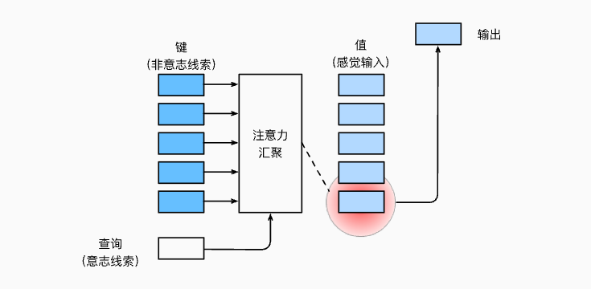
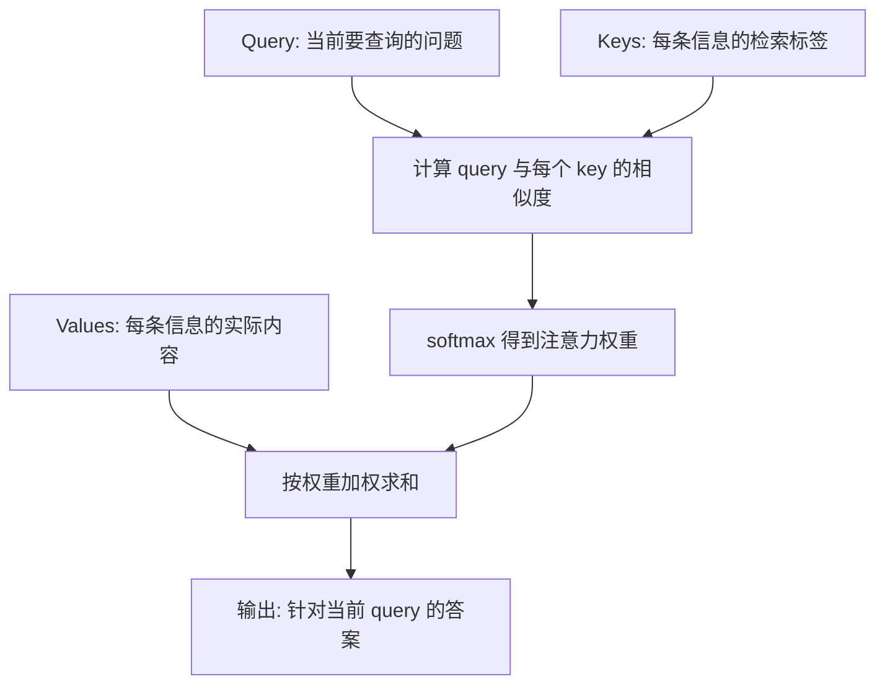

# 第 10 章：注意力机制

## 1. 本节重难点

### 1.1 注意力机制要解决什么问题

前面很多汇聚方式，本质上是在把一组输入压缩成一个输出。比如平均汇聚、固定权重汇聚、普通全连接层，都可以把多个信息合成一个结果。

但它们有一个关键问题：

> 同一组输入经过同一个汇聚规则，通常只能得到一个固定答案；query 变了，汇聚方式本身不一定跟着变。

注意力机制想解决的正是这个问题：

> 不同的 query 应该能从同一批信息里拿到不同答案。

一句话理解：

> 注意力机制不是固定地汇聚所有信息，而是根据当前 query 动态决定“该看谁、看多少”。



---

### 1.2 Q、K、V 分别是什么

注意力机制里有三个核心对象：


| 名称      | 含义 | 直觉理解                     |
| --------- | ---- | ---------------------------- |
| **Query** | 查询 | 我现在想找什么               |
| **Key**   | 键   | 每条信息用来被检索的标签     |
| **Value** | 值   | 真正被取出来并加权汇聚的内容 |

`key` 和 `value` 通常是一对：

```text
key   负责被 query 匹配
value 负责被取出来汇聚
```

这有点像查字典：

```text
query: 我想查什么
key:   每个条目的索引 / 标签
value: 每个条目的实际内容
```

注意力不是直接拿 query 去和 value 比，而是：

1. 用 query 和每个 key 计算相似度。
2. 把相似度变成权重。
3. 用这些权重对 value 做加权求和。

---

### 1.3 注意力汇聚的核心公式

假设有一个 query：

$$
q

$$

以及 $m$ 个 key-value 对：

$$
(k_1, v_1), (k_2, v_2), \ldots, (k_m, v_m)

$$

先计算 query 和每个 key 的注意力分数：

$$
a(q, k_i)

$$

再用 softmax 把分数转成权重：

$$
\alpha_i =
\frac{\exp(a(q, k_i))}
\sum_{j=1}^{m}\exp(a(q, k_j))}

$$

最后对 value 做加权求和：

$$
\text{Attention}(q, K, V)
= \sum_{i=1}^{m}\alpha_i v_i

$$

这个公式的本质是：

> query 决定每个 key 的权重，权重再决定每个 value 对最终输出贡献多少。

---

### 1.4 为什么 query 改变，答案就会改变

这是你这段理解里最关键的点。

同一组 key-value，如果 query 不同，计算出来的注意力权重就不同：

```text
query_1 -> 更关注 key_2 -> 输出更像 value_2
query_2 -> 更关注 key_5 -> 输出更像 value_5
```

原因是权重来自：

$$
\alpha_i = \text{softmax}(a(q, k_i))

$$

这里的 $q$ 直接参与了权重计算。只要 query 变了，$a(q, k_i)$ 就可能变，softmax 后的权重分布也会变，最终加权得到的输出也会变。

所以注意力机制和固定汇聚最大的区别是：

> 固定汇聚是“输入决定一个统一答案”；注意力汇聚是“query 决定从输入里取出哪个答案”。

---

### 1.5 和平均汇聚、固定权重层的区别

平均汇聚是：

$$
\frac{1}{m}\sum_{i=1}^{m}v_i

$$

它默认每个 value 一样重要，不管当前问题是什么，都平均看。

固定权重汇聚可以写成：

$$
\sum_{i=1}^{m}w_i v_i

$$

其中 $w_i$ 是训练出来的参数。它比平均汇聚灵活，但如果没有 query 参与，权重仍然更像是固定规则。

注意力汇聚是：

$$
\sum_{i=1}^{m}\alpha(q, k_i)v_i

$$

这里权重不是单纯固定参数，而是由 query 和 key 动态算出来的。


| 对比                    | 平均汇聚     | 固定权重汇聚   | 注意力汇聚             |
| ----------------------- | ------------ | -------------- | ---------------------- |
| **权重来源**            | 人为固定相等 | 训练得到       | query 和 key 动态计算  |
| **query 是否参与**      | 不参与       | 通常不参与     | 参与                   |
| **输出是否随 query 变** | 不会         | 通常不会       | 会                     |
| **核心能力**            | 粗略平均     | 学一个固定偏好 | 针对不同问题取不同信息 |

一句话：

> 平均汇聚是不管问什么都平均看，固定权重是不管问什么都按训练好的偏好看，注意力是问什么就按什么重新分配权重。

---

## 2. 核心流程图



机制链可以压缩成：

```text
query 提出问题
-> key 负责匹配
-> softmax 得到权重
-> value 按权重汇聚
-> 得到当前 query 对应的输出
```

---

## 3. 一个直觉例子

假设同一批 value 是一组课程笔记：

```text
v_1: RNN
v_2: LSTM
v_3: seq2seq
v_4: beam search
v_5: attention
```

如果 query 是“怎么解决长序列压缩丢信息”，注意力可能更关注 `attention` 和 `seq2seq`。

如果 query 是“怎么在解码时选输出序列”，注意力可能更关注 `beam search`。

同样一批资料，因为 query 不同，最终答案不同。

这就是注意力机制真正厉害的地方：

> 它不是把所有资料压成一个固定总结，而是每次根据问题重新选择相关资料。

---

## 4. 最容易错的点

1. 注意力机制不是简单求平均，而是根据 query 动态加权。
2. key 和 value 通常成对出现，但作用不同：key 用来匹配，value 用来输出。
3. query 不是被汇聚的内容，而是决定“看哪里”的问题。
4. 注意力权重来自 query 和 key 的相似度，不是直接凭空训练出一组固定权重。
5. softmax 的作用是把相似度分数变成权重分布，让权重非负且和为 1。
6. 输出是 value 的加权和，不是 key 的加权和。
7. 注意力的优势不是“参数更多”，而是“同一批输入可以对不同 query 给出不同输出”。

---

## 5. 本节必须记住

注意力机制的核心是 QKV：

> query 决定当前要找什么，key 负责被匹配，value 负责被取出并加权汇聚。

它相对普通汇聚的最大优势是：

> 权重不是固定的，而是随 query 动态变化，所以不同 query 可以从同一批 key-value 中得到不同答案。
