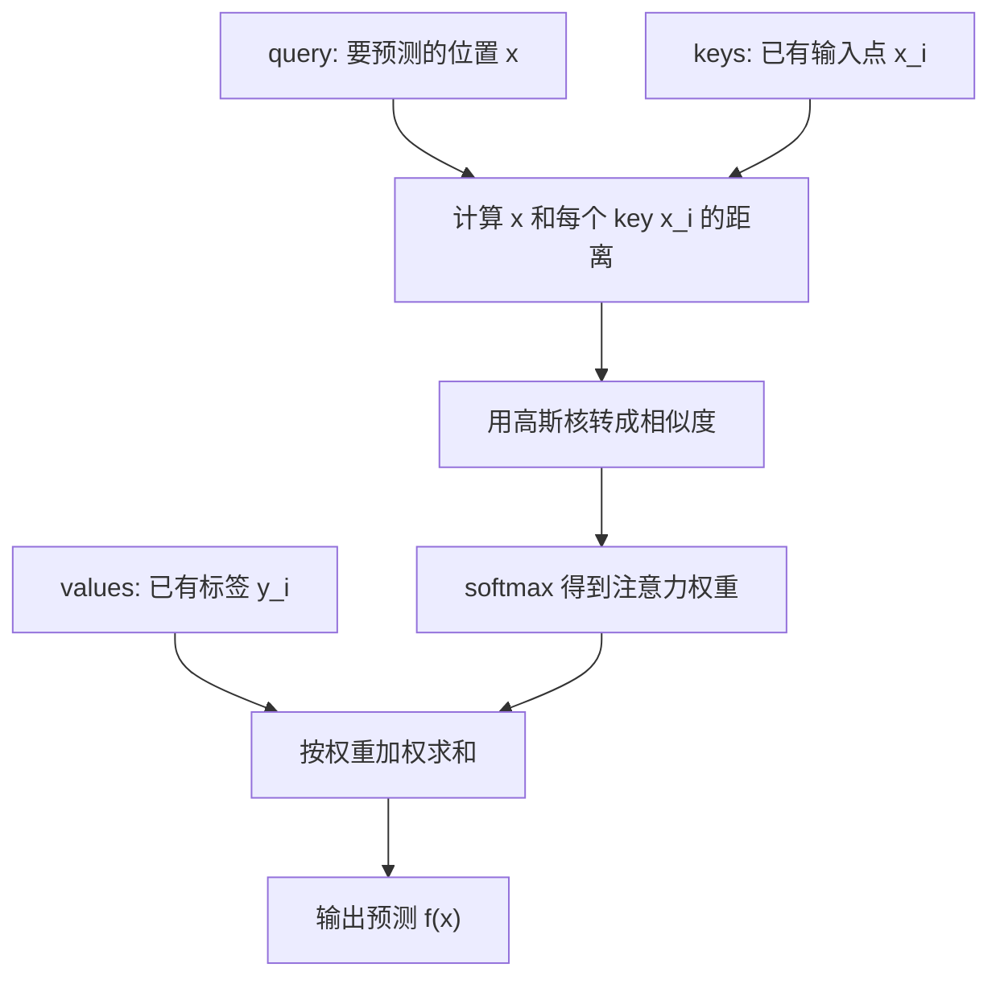

# 第 10 章：Nadaraya-Watson 核回归

## 1. 本节重难点

### 1.1 NW kernel regression 和注意力机制有什么关系

Nadaraya-Watson kernel regression 可以理解成注意力机制的一种非常直观的实现方式。

它要解决的问题是：

> 给定一个查询点 `x`，怎么根据已有样本点 `(x_i, y_i)` 预测当前位置的函数值？

它的核心思想是：

> 离 query 近的 key 分配更大权重，离 query 远的 key 分配更小权重，然后用这些权重对 value 做加权平均。

把它翻译成注意力语言：

| 核回归里的对象 | 注意力机制里的对象 | 含义 |
|---|---|---|
| 要预测的位置 $x$ | query | 当前要查询的位置 |
| 已有输入点 $x_i$ | key | 用来和 query 比相似度 |
| 已有标签 $y_i$ | value | 真正被加权汇聚的值 |
| 距离远近 | attention score | 决定权重大小 |

一句话理解：

> NW kernel regression 就是“按距离分配注意力”：离我近的样本更可信，离我远的样本参考价值更小。

---

### 1.2 非参数注意力汇聚

非参数版本没有要训练的权重参数，它直接使用一个核函数来计算 query 和 key 的相似度。

常见的是高斯核：

$$
K(x, x_i) =
\exp\left(-\frac{1}{2}(x - x_i)^2\right)
$$

然后用 softmax 归一化成注意力权重：

$$
\alpha_i(x) =
\frac{
\exp\left(-\frac{1}{2}(x - x_i)^2\right)
}{
\sum_j \exp\left(-\frac{1}{2}(x - x_j)^2\right)
}
$$

最后用这些权重对 value 做加权求和：

$$
f(x) =
\sum_i \alpha_i(x)y_i
$$

这个过程和注意力机制完全对应：

```text
query x
-> 和每个 key x_i 计算距离
-> 距离越近，权重越大
-> 对 value y_i 加权求和
-> 得到预测 f(x)
```

非参数版本的特点是：

1. 不需要训练参数。
2. 直接根据距离决定注意力权重。
3. 预测曲线通常比较平滑。
4. 但表达能力有限，可能和真实函数仍有明显差距。

---

### 1.3 带参数注意力汇聚

带参数版本会引入一个可学习参数 $w$，让模型自己学习“距离应该被放大还是缩小”。

常见形式是：

$$
\alpha_i(x) =
\frac{
\exp\left(-\frac{1}{2}((x - x_i)w)^2\right)
}{
\sum_j \exp\left(-\frac{1}{2}((x - x_j)w)^2\right)
}
$$

预测仍然是：

$$
f(x) =
\sum_i \alpha_i(x)y_i
$$

和非参数版本相比，带参数版本的区别是：

> 不再完全相信原始距离，而是学习一个参数 $w$，让模型自己决定距离对注意力权重的影响强度。

如果 $w$ 较大，距离差异会被放大，注意力更集中在很近的点上。

如果 $w$ 较小，距离差异会被压缩，注意力分布更平均。

---

### 1.4 为什么训练时要去掉自己

这是本节非常容易错的点。

训练带参数注意力汇聚时，如果用训练样本 $x_i$ 去预测自己的标签 $y_i$，不能把自己也放进 key-value 里面。

原因是：

> 如果 query 是 $x_i$，key 里也有 $x_i$ 自己，那么它和自己的距离是 0，注意力会很容易集中到自己身上。

这样模型就会出现一种“作弊”：

```text
用 x_i 查询
-> 最像的 key 还是 x_i 自己
-> 直接拿自己的 value y_i
-> 看起来预测很好
```

但这不是真正学会了拟合规律，而是把答案偷看到了。

所以训练时要做 leave-one-out：

> 预测某个样本时，只能看除自己以外的其他样本。

也就是：

```text
query: x_i
keys:  所有 x_j, j != i
values: 所有 y_j, j != i
```

一句话：

> 训练时去掉自己，是为了防止模型靠“复制自己的标签”得到虚假的好结果。

---

### 1.5 为什么带参数版本拟合更好，但可能没那么平滑

非参数版本完全由固定高斯核决定权重，距离变化时权重变化比较平滑，所以预测曲线也更平滑。

带参数版本会学习 $w$。如果训练后模型让注意力更集中，那么某些点附近的权重会突然变大，预测结果就会更贴近训练数据。

这会带来两个结果：

1. 拟合能力更强，曲线可能更接近真实样本。
2. 注意力分布更尖锐，曲线可能没有非参数版本那么平滑。

所以它们的区别不是“谁一定更好”，而是：

> 非参数版本更稳定平滑，带参数版本更灵活但更容易贴近训练样本局部变化。

---

## 2. 核心流程图



带参数版本只是在距离计算中加入可学习参数：

```text
非参数：距离 = x - x_i
带参数：距离 = (x - x_i) * w
```

---

## 3. 和普通注意力机制的对应关系

| 对比 | NW kernel regression | 一般注意力机制 |
|---|---|---|
| **query** | 要预测的位置 $x$ | 当前查询向量 |
| **key** | 已有样本输入 $x_i$ | 被检索的键 |
| **value** | 已有样本标签 $y_i$ | 被汇聚的值 |
| **权重依据** | 距离远近 | query-key 相似度 |
| **输出** | 对 $y_i$ 加权平均 | 对 value 加权求和 |

所以 NW kernel regression 是一个非常适合入门注意力的例子：

> 它把“query 根据 key 分配权重，再汇聚 value”这件事，用一维函数拟合讲得很直观。

---

## 4. 最容易错的点

1. NW kernel regression 不是普通平均，而是按 query 和 key 的距离分配权重。
2. 距离越近权重越大，距离越远权重越小。
3. 非参数版本没有训练参数，直接用固定高斯核。
4. 带参数版本会学习 $w$，让模型自己调整距离对权重的影响。
5. 训练时预测某个样本，必须去掉它自己，不能让它给自己分配注意力。
6. 去掉自己不是形式要求，而是为了防止模型偷看自己的标签。
7. 带参数版本通常拟合能力更强，但注意力可能更集中，所以曲线不一定更平滑。
8. query 和 key 在这里可以理解成 $x$ 和 $x_i$ 的相似程度，value 才是最后被加权求和的 $y_i$。

---

## 5. 本节必须记住

NW kernel regression 的本质是：

> 用 query 和 key 的距离决定注意力权重，再用这些权重对 value 做加权平均。

非参数和带参数的区别是：

> 非参数版本直接用固定核函数；带参数版本学习 $w$，让注意力分布更适合数据。

训练时最关键的边界是：

> 预测某个训练样本时不能看自己，否则模型会靠复制自己的 value 得到虚假的好拟合。
