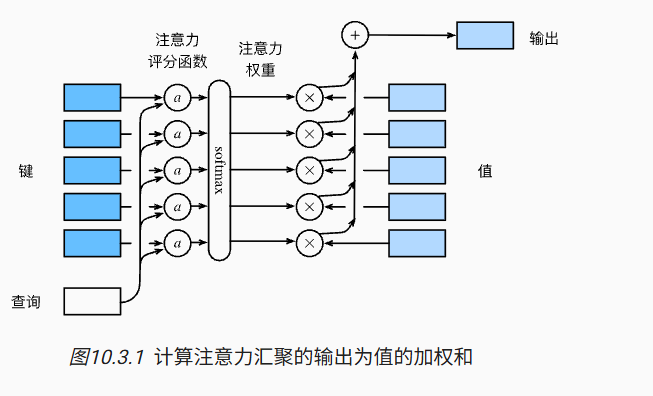
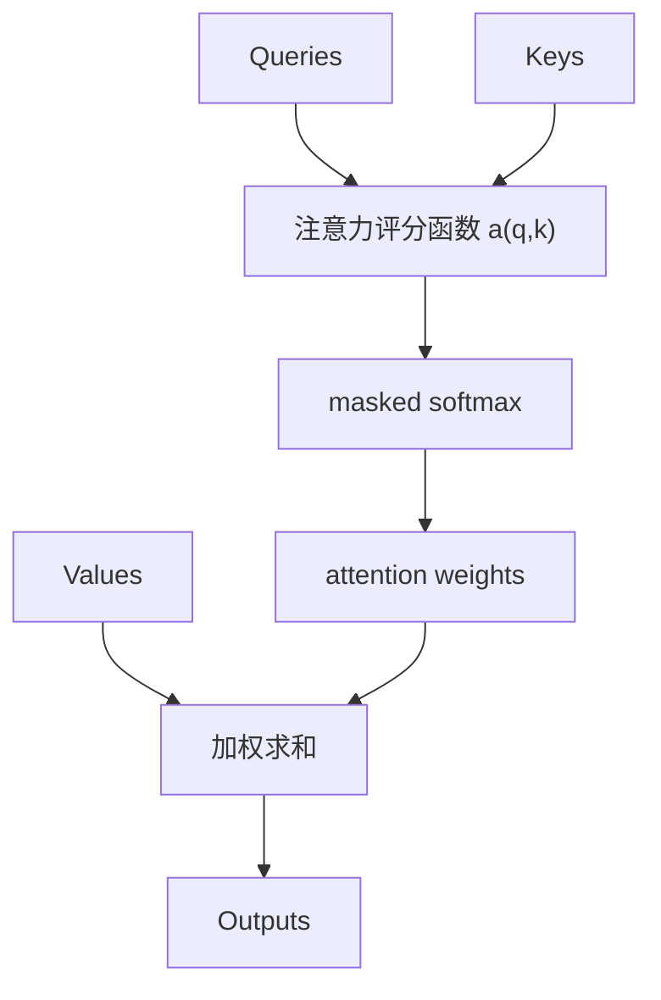

# 第 10 章：注意力评分函数

## 1. 本节重难点

### 1.1 注意力评分函数解决什么问题

注意力机制的完整过程可以拆成三步：

```text
query 和 key 计算相似度
-> softmax 把相似度变成注意力权重
-> 用注意力权重对 value 做加权求和
```

其中第一步“怎么计算 query 和 key 的相似度”，就是注意力评分函数要解决的问题。

一句话理解：

> 注意力评分函数负责回答：当前 query 应该给每个 key 分多少注意力。



---

### 1.2 注意力汇聚的基本公式

给定 query $q$，以及一组 key-value 对：

$$
(k_1, v_1), (k_2, v_2), \ldots, (k_m, v_m)
$$

先用注意力评分函数 $a(q, k_i)$ 计算相似度：

$$
a(q, k_i)
$$

再用 softmax 转成概率分布：

$$
\alpha(q, k_i)
=
\frac{\exp(a(q, k_i))}
\sum_{j=1}^{m}\exp(a(q, k_j))}
$$

最后对 value 做线性组合：

$$
\text{Attention}(q, K, V)
=
\sum_{i=1}^{m}\alpha(q, k_i)v_i
$$

这个公式的本质是：

> score 决定权重，权重决定每个 value 对输出贡献多少。

---

## 2. masked softmax：不给无效 key 分配注意力

### 2.1 为什么需要 masked softmax

序列数据经常会 padding 到同一个长度。padding 位置只是为了凑矩阵形状，不是真实 token。

所以注意力里不能让 query 去关注 padding key：

```text
真实 key -> 可以分配注意力
padding key -> 注意力权重必须为 0
```

这和前面 masked loss 的思想很像：

> padding 可以存在于张量形状里，但不能参与语义计算。

### 2.2 masked softmax 怎么实现

常见做法是使用 `valid_lens` 表示每个样本有多少个有效 key。

超过 `valid_lens` 的位置，会在 softmax 前被替换成一个非常小的负数，比如：

```text
-1e6
```

因为：

$$
\exp(-\infty) \approx 0
$$

所以这些位置经过 softmax 后权重接近 0。

一句话：

> masked softmax 的本质，是在 softmax 前把无效位置打成负无穷，让它们分不到注意力。

---

## 3. 加性注意力

### 3.1 加性注意力适合什么情况

加性注意力（additive attention）常用于 query 和 key 维度不一样的情况。

假设：

$$
q \in \mathbb{R}^{d_q}, \quad k \in \mathbb{R}^{d_k}
$$

如果 $d_q \neq d_k$，就不能直接做点积相似度。

所以加性注意力先分别对 query 和 key 做线性变换，把它们变到同一个隐藏维度：

$$
W_q q \in \mathbb{R}^{h}
$$

$$
W_k k \in \mathbb{R}^{h}
$$

然后把它们相加，再经过激活函数：

$$
\tanh(W_q q + W_k k)
$$

最后用 $w_v$ 投影成一个标量分数：

$$
a(q, k) = w_v^\top \tanh(W_q q + W_k k)
$$

再经过 masked softmax 得到注意力权重。

一句话：

> 加性注意力先把 query 和 key 映射到同一 hidden size，再用一个小网络算相似度。

---

### 3.2 加性注意力的形状变化

假设：

```text
queries: (batch_size, num_queries, d_q)
keys:    (batch_size, num_kv,      d_k)
values:  (batch_size, num_kv,      d_v)
```

线性变换后：

```text
W_q(queries): (batch_size, num_queries, h)
W_k(keys):    (batch_size, num_kv,      h)
```

为了让每个 query 都和每个 key 打分，需要得到：

```text
(batch_size, num_queries, num_kv, h)
```

做法是利用广播机制：

```text
queries 增加 key 维度 -> (batch_size, num_queries, 1,      h)
keys    增加 query 维度 -> (batch_size, 1,           num_kv, h)
相加后                  -> (batch_size, num_queries, num_kv, h)
```

再经过 `tanh` 和 $w_v$ 投影，把最后的 hidden 维消掉：

```text
scores: (batch_size, num_queries, num_kv)
```

这个 `scores` 的含义是：

> 每个样本里，每个 query 对每个 key 都有一个注意力分数。

然后：

```text
scores -> masked softmax -> attention_weights
attention_weights @ values -> outputs
```

最终输出形状是：

```text
outputs: (batch_size, num_queries, d_v)
```

---

### 3.3 为什么有时注意力权重看起来是均匀的

你提到的代码例子里，如果所有 key 都一样，那么不同 key 得到的 score 可能也一样。

比如同一个 query 对所有 key 的分数都是：

```text
[c, c, c, c]
```

softmax 后就会变成均匀分布：

```text
[0.25, 0.25, 0.25, 0.25]
```

所以如果代码里看到注意力权重一直很平均，不一定是注意力机制错了，也可能是测试数据太特殊：

> 当所有 key 没有区分度时，query 就很难对不同 key 分配不同权重。

---

## 4. 缩放点积注意力

### 4.1 缩放点积注意力的前提

缩放点积注意力（scaled dot-product attention）直接用 query 和 key 的点积来计算相似度：

$$
a(q, k) = \frac{q^\top k}{\sqrt{d}}
$$

这里要求 query 和 key 的特征维度必须相同：

$$
q, k \in \mathbb{R}^{d}
$$

原因是点积需要对应维度相乘再相加：

```text
q_1 k_1 + q_2 k_2 + ... + q_d k_d
```

如果 $q$ 和 $k$ 维度不同，就不能直接点积。

---

### 4.2 为什么要除以 $\sqrt{d}$

如果特征维度 $d$ 很大，点积值的方差也会变大，softmax 输入就可能变得很大。

这会导致 softmax 过于尖锐：

```text
某一个位置权重接近 1
其他位置权重接近 0
```

梯度也会变得不稳定。

所以要除以 $\sqrt{d}$ 做缩放：

$$
\frac{q^\top k}{\sqrt{d}}
$$

它的本质是：

> 消除维度大小对点积分数尺度的影响，让模型关注相似度本身，而不是因为维度多导致分数自然变大。

---

### 4.3 缩放点积注意力的形状变化

假设：

```text
queries: (batch_size, num_queries, d)
keys:    (batch_size, num_kv,      d)
values:  (batch_size, num_kv,      d_v)
```

先计算：

$$
QK^\top
$$

通过 batch matrix multiplication 得到：

```text
scores: (batch_size, num_queries, num_kv)
```

含义是：

> 每个 query 对每个 key 都有一个分数。

然后：

```text
scores / sqrt(d)
-> masked softmax
-> attention_weights
-> attention_weights @ values
```

最终输出：

```text
outputs: (batch_size, num_queries, d_v)
```

注意：

1. query 和 key 的最后一维必须相同，因为它们要点积。
2. key 和 value 的数量必须相同，因为它们是一一对应的 key-value 对。
3. value 的特征维度 $d_v$ 不要求和 query/key 相同，因为最后只是对 value 做线性组合。

---

## 5. 加性注意力和缩放点积注意力对比

| 对比 | 加性注意力 | 缩放点积注意力 |
|---|---|---|
| **相似度计算** | $w_v^\top \tanh(W_q q + W_k k)$ | $q^\top k / \sqrt{d}$ |
| **query/key 维度要求** | 可以不同 | 必须相同 |
| **实现方式** | 广播后相加，再投影成分数 | batch matrix multiplication |
| **参数量** | 有额外可学习参数 | 通常更少 |
| **速度** | 相对慢 | 矩阵乘法更高效 |
| **输出分数形状** | `(batch_size, num_queries, num_kv)` | `(batch_size, num_queries, num_kv)` |

一句话：

> 加性注意力用小网络学相似度，缩放点积注意力直接用向量点积算相似度。

---

## 6. 核心流程图



机制链：

```text
Q 和 K 计算 scores
-> 用 valid_lens mask 掉无效 key
-> softmax 得到 attention weights
-> attention weights 与 V 做矩阵乘法
-> 得到输出
```

---

## 7. 最容易错的点

1. 注意力评分函数只负责算 query-key 的相似度，最终输出来自 value 的加权和。
2. masked softmax 是为了不给 padding key 分配注意力。
3. mask 的实现通常是在 softmax 前把无效位置设成很大的负数。
4. 加性注意力适合 query 和 key 维度不一致的情况，因为它会先线性变换到同一 hidden size。
5. 加性注意力得到 `(batch_size, num_queries, num_kv)` 分数，靠广播机制完成每个 query 对每个 key 的组合。
6. 缩放点积注意力要求 query 和 key 的最后一维相同，因为要做点积。
7. 除以 $\sqrt{d}$ 是为了控制点积分数的尺度，不让维度越大分数天然越大。
8. key 和 value 的数量必须一一对应，但 value 的特征维度不要求等于 query/key 的特征维度。
9. dropout 作用在注意力权重上时，是为了防止模型过度依赖少数 token。
10. 如果所有 key 都一样，softmax 后可能出现均匀注意力，这可能只是代码样例的特殊情况。

---

## 8. 本节必须记住

注意力评分函数的核心是：

> 用 query 和 key 算分数，用 softmax 变权重，再用权重对 value 做加权求和。

三块内容要分清：

> masked softmax 解决无效 key；加性注意力解决 query/key 维度可不同；缩放点积注意力用矩阵乘法高效计算相似度。
