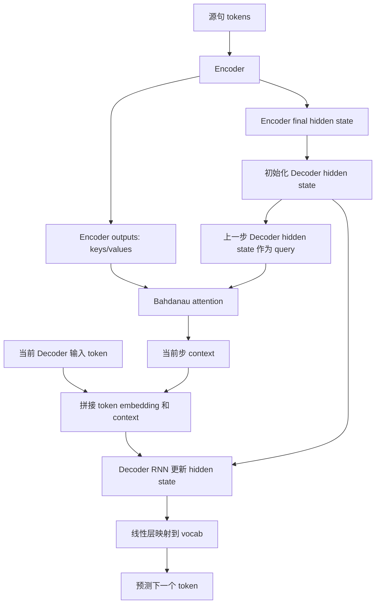

# 第 10 章：Bahdanau 注意力

## 1. 本节重难点

### 1.1 Bahdanau 注意力解决什么问题

前面的 seq2seq 架构里，Encoder 通常把整个源句压缩成一个固定的 `context`，比如直接用最后一个 hidden state：

$$
C = H_T

$$

然后 Decoder 每一步都依赖这个固定的 `context` 去生成目标词。

这个做法的问题是：

> 翻译每一个目标词时，并不一定都需要源句的全部信息，而是更需要源句中和当前目标词相关的那一部分信息。

比如翻译到某个法语词时，它可能主要对应英语源句中的某一个词或短语，而不是整句话平均地一起看。

Bahdanau 注意力的核心改进是：

> Decoder 每生成一步，都用当前 Decoder 状态作为 query，去 Encoder 的所有 hidden states 里重新分配注意力，得到当前这一步专属的 context。

一句话理解：

> 普通 seq2seq 用一个固定摘要翻译整句话；Bahdanau 注意力让 Decoder 每一步都回头看源句，并选择当前最该看的部分。

---

### 1.2 固定 context 和动态 context 的区别

普通 seq2seq：

```text
Encoder 最后 hidden state -> 固定 context
固定 context -> Decoder 每一步都用同一个信息
```

Bahdanau attention：

```text
Encoder 所有 hidden states -> 作为 key/value 资料库
Decoder 上一步 hidden state -> 作为 query
query 查询 key/value -> 得到当前步 context
当前步 context + 当前输入 token + Decoder hidden state -> 预测下一个词
```

关键区别是：


| 对比                 | 普通 seq2seq              | Bahdanau 注意力                           |
| -------------------- | ------------------------- | ----------------------------------------- |
| **context 来源**     | Encoder 最后 hidden state | Encoder 所有时间步 hidden states 的加权和 |
| **context 是否变化** | 基本固定                  | 每个 Decoder 时间步都重新计算             |
| **query 是什么**     | 没有显式 query            | Decoder 上一步 hidden state               |
| **解决的问题**       | 粗略压缩源句              | 每一步选择源句中更相关的部分              |

所以它不是推翻 Encoder-Decoder，而是在 Decoder 生成时加入了注意力查询机制。

---

## 2. Encoder 输出和 Decoder 状态要分清

### 2.1 Encoder outputs 是什么

Encoder 读完整个源句后，不只会得到最后一个 hidden state，也会得到每个时间步的输出。

可以理解成：

```text
Encoder outputs:
每个样本、每个源句时间步、最后一层的 hidden state
```

常见形状可以记成：

```text
enc_outputs: (batch_size, num_steps, num_hiddens)
```

它本质上是一个“源句资料库”：

```text
源句第 1 个 token 的表示
源句第 2 个 token 的表示
...
源句第 T 个 token 的表示
```

在 Bahdanau 注意力里，`enc_outputs` 同时作为：

```text
keys   = enc_outputs
values = enc_outputs
```

也就是用 Encoder 每个时间步的 hidden state 被查询，也用这些 hidden state 被加权汇聚。

---

### 2.2 Decoder hidden state 是什么

RNN / GRU / LSTM 的输出里要区分两个东西：


| 名称             | 含义                             | 常见形状                                |
| ---------------- | -------------------------------- | --------------------------------------- |
| **output**       | 所有时间步、最后一层的隐藏状态   | `(batch_size, num_steps, num_hiddens)`  |
| **hidden state** | 最后一个时间步、所有层的隐藏状态 | `(num_layers, batch_size, num_hiddens)` |

你这段里强调得很对：`output` 和 `hidden_state` 不是同一个东西。

`output` 更像：

> 每个时间步都留下来的结果。

`hidden_state` 更像：

> RNN 跑完当前序列后，最后留给下一轮继续更新的状态。

如果是多层 RNN，`hidden_state` 里会包含所有层的最后时间步状态，所以它有 `num_layers` 这个维度。

---

## 3. AttentionDecoder 的 state 三元组

Bahdanau attention decoder 通常会把 Encoder 的结果组织成一个三元组：

```text
state = (enc_outputs, hidden_state, enc_valid_lens)
```

三个部分分别是：


| state 部分       | 含义                     | 作用                                |
| ---------------- | ------------------------ | ----------------------------------- |
| `enc_outputs`    | Encoder 所有时间步的输出 | 作为 attention 的 keys 和 values    |
| `hidden_state`   | Decoder 当前隐藏状态     | 作为下一步 RNN 的状态，也提供 query |
| `enc_valid_lens` | 源句有效长度             | mask 掉 Encoder padding 部分        |

这里可以把 `state[0]` 类比成一个“源句资料库”：

```text
state[0] = enc_outputs
        = Encoder 对源句每个 token 留下的表示
        = attention 每一步要查询的 keys / values
```

注意这个“资料库”不是静态文本库，而是 Encoder 已经把源句上下文编码后的隐藏状态集合。Decoder 每一步用自己的 query 去查它，取出当前最需要的源句信息。

### 3.1 为什么需要 `enc_valid_lens`

Encoder 输入源句时也会有 padding。

如果源句被 padding 到长度 7，不代表 7 个位置都是真实 token：

```text
真实 token: 5 个
padding:   2 个
```

注意力查询时，不能给 padding 对应的 hidden state 分配注意力。

所以要用 `enc_valid_lens`：

> 只让 Decoder 关注源句真实 token 对应的 Encoder hidden states，忽略 padding 位置。

这和前面 `masked softmax` 是同一个逻辑。

---

## 4. Decoder 每一步如何融入注意力

每个 Decoder 时间步大致做下面几件事。

### 4.1 用上一步 Decoder hidden state 当 query

当前要翻译下一个词时，Decoder 需要知道：

> 我已经翻译到哪里了？接下来更应该看源句的哪一部分？

这个信息就在 Decoder 上一步的 hidden state 里。

所以 Bahdanau attention 用：

```text
query = Decoder 上一步 hidden state
```

常见写法是取最后一层 hidden state：

```text
query: (batch_size, 1, num_hiddens)
```

这里的 `1` 表示当前 Decoder 时间步只有一个 query。

---

### 4.2 用 query 查询 Encoder outputs

Encoder outputs 作为 keys 和 values：

```text
keys:   enc_outputs
values: enc_outputs
```

用加性注意力计算：

```text
query 和每个 encoder hidden state 打分
-> masked softmax 得到 attention weights
-> 对 encoder hidden states 加权求和
-> 得到当前步 context
```

这个 context 不是固定的，而是当前 Decoder 步专属的：

$$
C_t = \sum_i \alpha_{t,i}H_i^{enc}

$$

其中：

1. $t$ 是 Decoder 当前时间步。
2. $i$ 是 Encoder 源句时间步。
3. $\alpha_{t,i}$ 表示 Decoder 第 $t$ 步对 Encoder 第 $i$ 个位置的注意力。

一句话：

> 每生成一个目标词，Decoder 都会重新问一次：现在我应该看源句的哪些位置？

---

### 4.3 把 context 和当前输入一起送入 RNN

Decoder 当前步通常有三个关键信息：

1. 当前输入 token：训练时通常是目标句中上一个真实 token，预测时是上一步预测 token。
2. 当前步 context：由 attention 从 Encoder outputs 中动态汇聚得到。
3. 上一步 Decoder hidden state：保存已经生成的目标端历史。

所以机制链是：

```text
上一个目标 token -> embedding 得到当前输入 x
上一步 hidden state -> query
query 查询 enc_outputs -> context
当前输入 x + context + 上一步 hidden state -> 送入 RNN
RNN 更新 hidden state
hidden state 经过线性层 -> vocab logits
softmax / cross entropy -> 预测下一个词
```

这说明 Bahdanau attention 的唯一核心变化是：

> context 不再是固定的，而是每一步由 query 动态生成。

Decoder 后面的 RNN 更新、线性层投影到词表、计算预测结果，和普通 seq2seq 的基本逻辑是一致的。

---

## 5. 核心流程图



这张图要抓住一个点：

> Encoder outputs 是资料库，Decoder hidden state 是问题状态，attention 根据问题从资料库里取当前需要的信息。

---

## 6. 为什么 Bahdanau 注意力效果更好

普通 seq2seq 的问题是：

```text
所有源句信息 -> 一个固定 context
```

这很容易让长句信息丢失，尤其是源句很长时，前面的词很难完整压缩到最后一个 hidden state 里。

Bahdanau attention 改成：

```text
每一步 Decoder hidden state -> 查询 Encoder 所有 hidden states
```

所以它有两个优势：

1. **缓解长句信息瓶颈**：不用把所有源句信息都压进一个向量。
2. **按需关注源句位置**：翻译不同目标词时，可以关注不同源词。

一句话：

> 它让 Decoder 不再只拿一份固定总结，而是每一步都能回到源句中查自己当前最需要的信息。

---

## 7. 最容易错的点

1. Bahdanau attention 不是换掉 Encoder-Decoder，而是在 Decoder 每一步加入动态 context。
2. Encoder outputs 是所有源句时间步的隐藏状态，不只是最后一个 hidden state。
3. Encoder outputs 在注意力里通常同时作为 keys 和 values。
4. Decoder 上一步 hidden state 作为 query，用来决定当前应该关注源句哪里。
5. `output` 和 `hidden_state` 要区分：`output` 是所有时间步最后一层结果，`hidden_state` 是最后时间步所有层状态。
6. 多层 RNN 的 `hidden_state` 有 `num_layers` 维度，因为每一层都有自己的最后状态。
7. `enc_valid_lens` 用来 mask 源句 padding，不能让 Decoder 关注 padding hidden states。
8. context 是每个 Decoder 时间步动态变化的，不是整句固定一个。
9. 当前输入 token、当前 context、上一步 hidden state 三者共同决定下一步 Decoder 更新。

---

## 8. 本节必须记住

Bahdanau attention 的核心是：

> 用 Decoder 上一步 hidden state 当 query，去查询 Encoder 所有 hidden states，动态得到当前步 context。

它比普通 seq2seq 强的地方是：

> 普通 seq2seq 用固定 context 翻译整句；Bahdanau attention 每一步都按当前翻译进度重新选择源句中最相关的信息。
