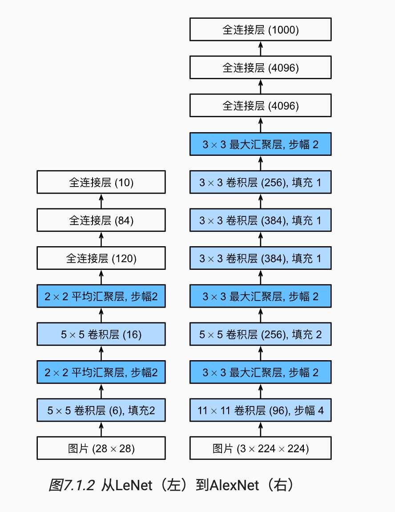
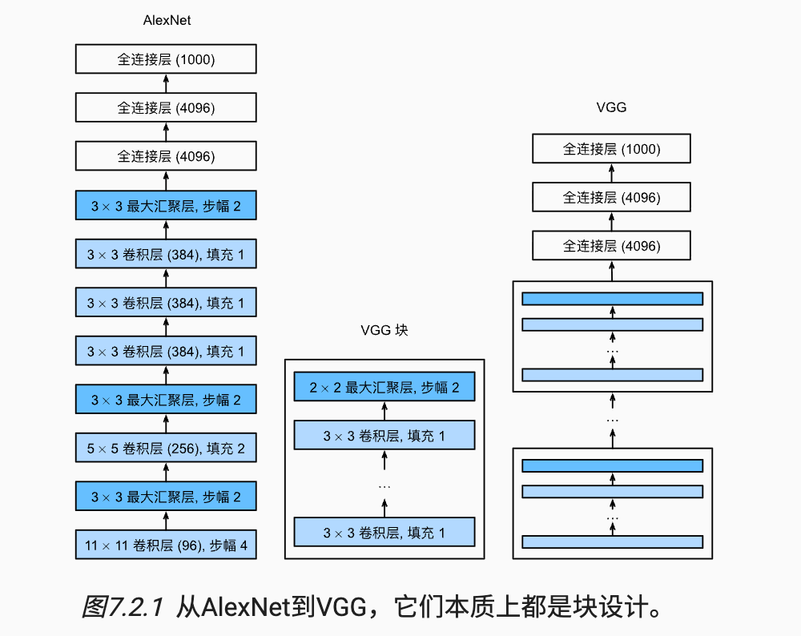
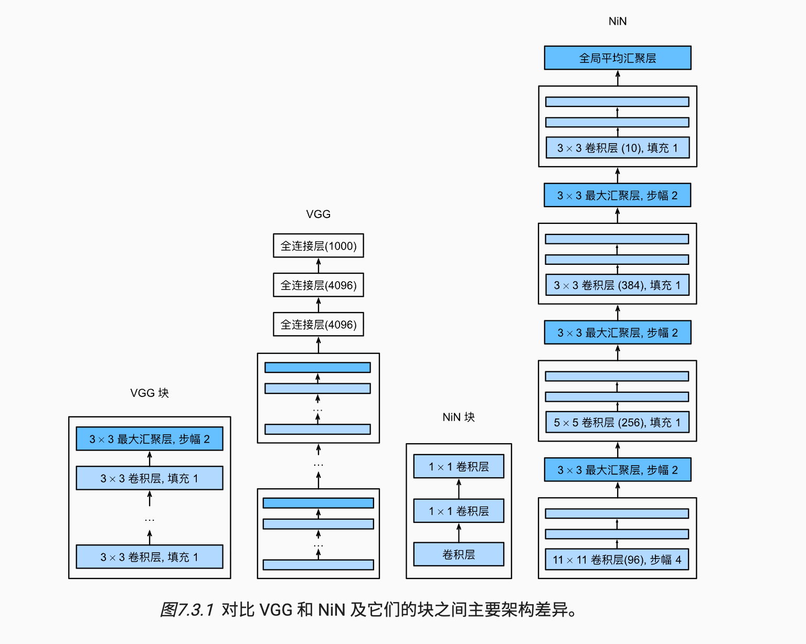
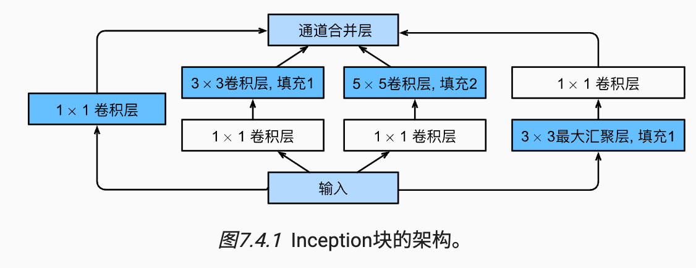
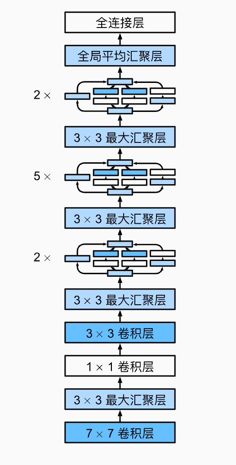
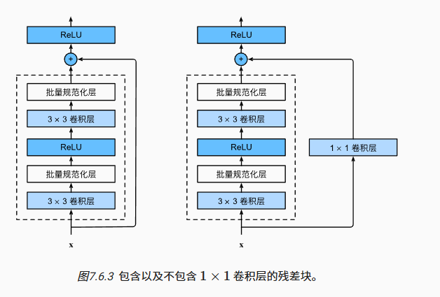
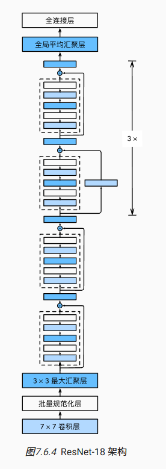
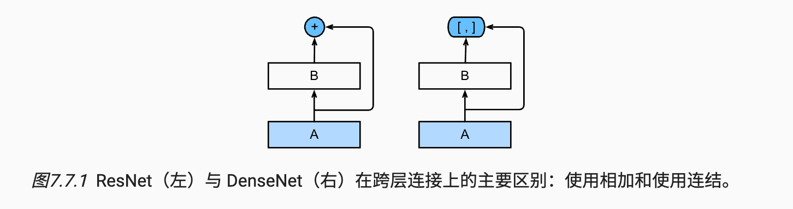
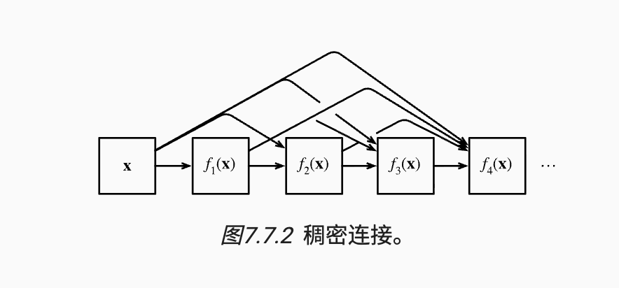

### 一、AlexNet

1. 通过卷积层+汇聚层，最后增加全连接层输出结果

### 二、VGG

1. 通过块设计，前两个块有一个卷积层，后三个块有2个卷积层，最后连接3个卷积层（11层）
2. 同样是卷积层+激活函数+汇聚层设计，增加输出通道数量
3. 利用3*3的多个卷积核代替  7*7的卷积核，降低参数量，同时激活层更多，增强了非线性

### 三、NIN

1. 通过1*1卷积层的设计代替全连接层，引入激活函数后，对每一个像素点做mlp，提高了非线性表达能力(本质上是将每一个像素点作为单个样本，通道数作为样本特征向量)
2. 最后使用全局平均池化（GAP），输出通道数为最终输出的分类任务类别数量，无参数不需要训练，防止过拟合

### 四、最大与平均汇聚层

1. 最大汇聚层：抓住最显著特征，快速响应
2. 平均汇聚层：抓住局部范围内的整体特征，更加平滑

### 五、GoogleNet

1. 多样的filter（不同大小的卷积核），能提取模型的不同尺度特征
2. 进行输出通道维度拼接，将不同特征的输出通道结果合并，从而能识别不同特征
3. 1*1cnn减少通道数，减少了计算量

### 六、BatchNormalization

1. 全连接层和CNN的归一化方式不同，全连接层是对每一个特征维度进行归一化，CNN是对每一个通道单独进行归一化（batch,height,width），然后训练scale、shift
2. 归一化的方法就是变成标准正态
3. 有效的原因：使每一层输出稳定，防止梯度震荡，从而允许更大的学习率

### 七、ResNet

1. H(x)=F(x)+x，实际学习的是F（x）,实际输出和想要的是H(x),通过学习F(x)间接实现
2. 有效的原因：承认某些层对loss的降低无效，这些层将F（x）训练为趋近于0，对loss降低显著的层正常训练，这样不会导致梯度消失的问题。在F==0时，局部梯度仍然为1，这样让深层网络训练更加稳定（参数更新更加容易），在无用层被训练为0时，不会影响有效层的正常参数更新

### 八、DenseNet

1. 稠密网络对比残差网络最大的提升是：采用稠密结构，他在通道维度上将每一层输出结果相连，从而确保了信息的完整性，旧特征被显式保留，不与新特征相加（特征复用），梯度可以多条路径回传（可以直接访问浅层特征）
2. 由于通道数过多必须要使用过渡层减少weight,height（平均池化层保留局部特征并压缩分辨率）,channel（1*1卷积层），降低训练的显存压力
3. 设置较小的growth_rate:因为通道数的增加是线性的增长很快，且有大量信息重复，所以小的grow_rate让cnn只保留少量新特征，完整保留所有原来特征（少学+复用）
4. **对比resnet**：resnet有效的原因是防止更新参数后变坏（通过训练让某些层可以F==0），densenet有效的原因是复用所有历史特征，拼接防止原始信息丢失

