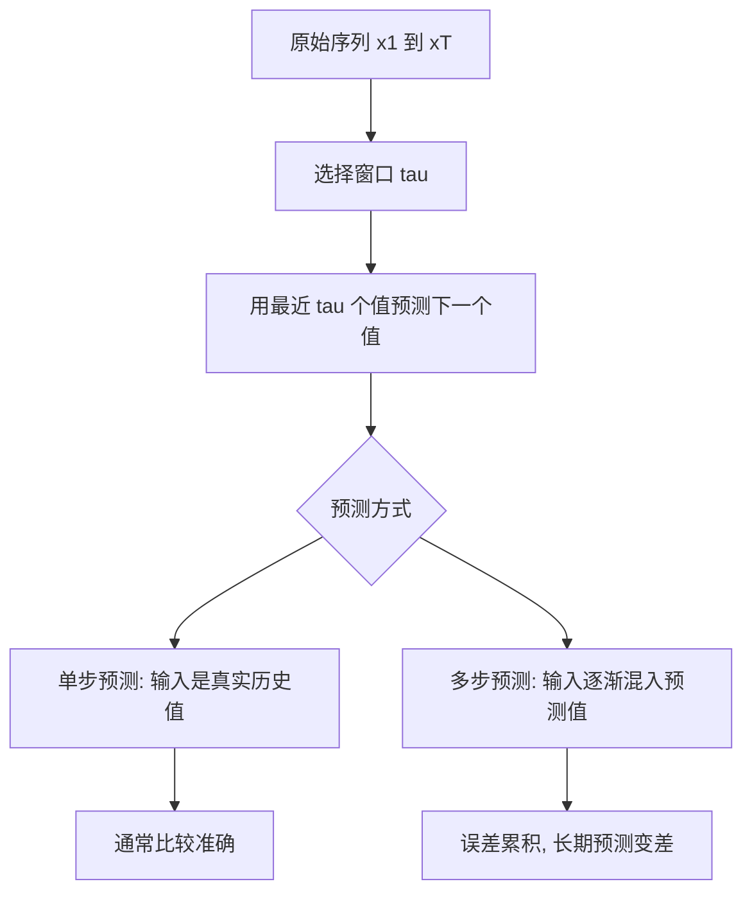

# 第 8 章：序列模型基础

## 1. 本节重难点

### 1.1 自回归模型

自回归模型的核心是：用过去的序列值预测当前或未来的值。

完整形式：

$$
P(x_t \mid x_1, x_2, \ldots, x_{t-1})
$$

难点：历史长度会不断变长，直接把所有历史值都作为输入不现实。

所以通常只看最近 $\tau$ 个时间步：

$$
x_t = f(x_{t-\tau}, x_{t-\tau+1}, \ldots, x_{t-1})
$$

本节中 `tau = 4`，表示用前 4 个值预测下一个值，而不是一次预测 4 个值。

---

### 1.2 隐变量自回归模型

固定窗口自回归只看最近 $\tau$ 步，可能丢掉更早的信息。

隐变量自回归模型的思想是：不用每次都拿出全部历史，而是用隐藏状态 $h_t$ 总结历史信息。

$$
h_t = g(h_{t-1}, x_t)
$$

$$
x_{t+1} = f(h_t)
$$

这就是后面 RNN 的动机：隐藏状态负责记忆过去。

---

### 1.3 链式法则和马尔可夫假设

序列的联合概率可以按时间展开：

$$
P(x_1, \ldots, x_T)
= P(x_1)P(x_2 \mid x_1)\cdots P(x_T \mid x_1,\ldots,x_{T-1})
$$

注意：这叫联合概率的链式法则，不是全概率公式。

马尔可夫假设的关键是“截断历史”：

一阶马尔可夫：

$$
P(x_t \mid x_1,\ldots,x_{t-1}) = P(x_t \mid x_{t-1})
$$

$\tau$ 阶马尔可夫：

$$
P(x_t \mid x_1,\ldots,x_{t-1})
= P(x_t \mid x_{t-\tau},\ldots,x_{t-1})
$$

本节 `tau = 4` 可以理解为 4 阶马尔可夫近似。

---

## 2. 单步预测和多步预测

### 2.1 单步预测为什么准

单步预测每次都使用真实历史值作为输入：

$$
(x_1,x_2,x_3,x_4) \rightarrow \hat{x}_5
$$

$$
(x_2,x_3,x_4,x_5) \rightarrow \hat{x}_6
$$

因为输入都是真实值，所以误差不会在输入端累积，预测曲线通常看起来比较准。

---

### 2.2 多步预测为什么越来越差

多步预测会把模型自己的预测结果继续作为下一步输入：

$$
(x_1,x_2,x_3,x_4) \rightarrow \hat{x}_5
$$

$$
(x_2,x_3,x_4,\hat{x}_5) \rightarrow \hat{x}_6
$$

$$
(x_3,x_4,\hat{x}_5,\hat{x}_6) \rightarrow \hat{x}_7
$$

一旦 $\hat{x}_5$ 有误差，这个误差会进入后续输入，后面又继续基于带误差的值预测，所以误差会逐步累积。

这就是多步预测比单步预测难得多的原因。

---

## 3. 核心流程图

---

## 4. 最容易错的点

1. 自回归不是“随便用条件概率”，而是用历史序列预测当前/未来。
2. 链式展开不是全概率公式，而是联合概率的链式法则。
3. 马尔可夫模型的重点不是公式本身，而是“当前只依赖最近一步或最近若干步”的假设。
4. `tau = 4` 表示输入窗口长度是 4，每次仍然只预测下一个值。
5. 单步预测准不代表长期预测准，因为单步预测用真实历史值，多步预测会用自己的预测值。
6. 多步预测变差的本质原因是误差反馈和误差累积。

---

## 5. 本节必须记住

序列模型的核心矛盾是：历史信息很重要，但完整历史太长。

解决思路有两类：

1. 固定窗口：只看最近 $\tau$ 步，简单但可能丢远期信息。
2. 隐藏状态：用 $h_t$ 总结历史，是 RNN 的基础。

