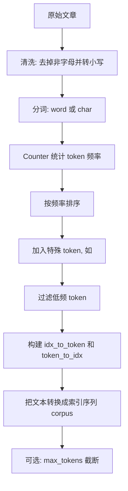

# 第 8 章：文本预处理

## 1. 本节重难点

### 1.1 文本预处理的目标

深度学习模型不能直接处理原始文字，必须先把文本转换成数字序列。

核心流程是：

$$
原始文本 \rightarrow 清洗文本 \rightarrow 分词 \rightarrow 构建词表 \rightarrow 文本转索引
$$

本节最终要得到两样东西：

1. `corpus`：整篇文章对应的索引序列。
2. `vocab`：词元和数字之间的双向映射表。

---

### 1.2 分词：把文本拆成 token

token 是文本模型处理的最小单位，可以是单词，也可以是字符。

按单词分词：

$$
\text{"the time machine"} \rightarrow [\text{"the"}, \text{"time"}, \text{"machine"}]
$$

按字符分词：

$$
\text{"time"} \rightarrow [\text{"t"}, \text{"i"}, \text{"m"}, \text{"e"}]
$$

这一步的重点不是模型训练，而是先把一篇文章拆成可统计、可编号的基本单位。

---

### 1.3 词频统计和词表

分词后需要统计每个 token 出现的次数：

$$
\{\text{token}: \text{freq}\}
$$

例如：

```text
the -> 2261
time -> 200
machine -> 85
```

常用 `Counter` 得到词频，再按频率从高到低排序。高频词排在前面，通常会获得更小的索引。

词表 `Vocab` 的核心是两个方向的映射：

1. `idx_to_token`：索引到 token。
2. `token_to_idx`：token 到索引。

这两个表必须同时存在，因为训练时要把 token 转成数字，解释结果时又要把数字转回 token。

---

### 1.4 特殊 token 和低频词

词表通常会加入特殊 token：

```text
<unk>
```

`<unk>` 表示未知词。遇到词表中不存在的 token，就映射到 `<unk>` 的索引，通常是 0。

还可以设置 `min_freq`，把出现次数太少的 token 过滤掉。

这样做的原因是：

1. 减小词表大小。
2. 降低稀有词带来的噪声。
3. 控制模型输入维度和训练成本。

---

### 1.5 文本转索引和截断

构建好词表后，就可以把文本转换成数字序列：

$$
[\text{"the"}, \text{"time"}, \text{"machine"}]
\rightarrow
[1, 19, 50]
$$

整篇文章会被展平成一个长序列：

$$
corpus = [1, 19, 50, 40, \ldots]
$$

如果设置 `max_tokens`，就只保留前面指定数量的 token：

```text
corpus = corpus[:max_tokens]
```

这不是“模型不能输入太多”这么简单，而是为了控制数据规模，方便后续训练和实验。

---

## 2. 核心流程图



---

## 3. 最容易错的点

1. `idx_to_token` 和 `token_to_idx` 不是两个词表，而是同一个词表的两个方向。
2. `Counter` 得到的是 token 的频率，不是最终词表；排序、过滤、加入特殊 token 后才形成词表。
3. `<unk>` 不是结束标志，而是未知词标志；结束标志通常会写成 `<eos>`。
4. `min_freq` 是过滤低频 token，不是过滤低频句子。
5. `max_tokens` 是限制最终语料索引序列长度，不是限制词表大小。
6. 分词单位不同，词表也不同：word-level 和 char-level 会得到完全不同的 token 集合。

---

## 4. 本节必须记住

文本预处理的本质是：

> 把人能读的文本，转换成模型能处理的整数序列。

最关键的中间结构是词表：

$$
token \leftrightarrow index
$$

后续语言模型训练时，模型真正看到的不是单词本身，而是这些 token 对应的数字索引。

