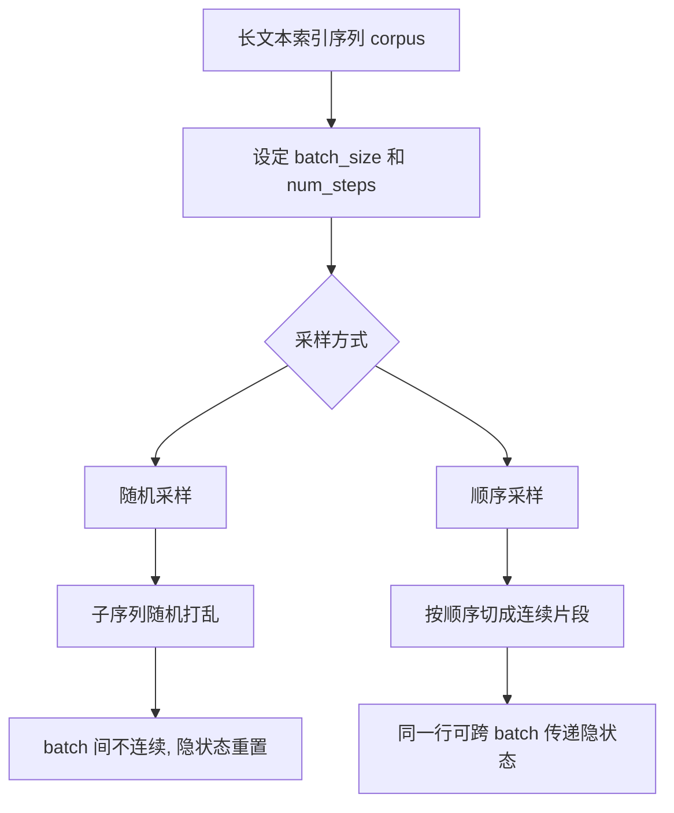

# 第 8 章：语言模型和数据集

## 1. 本节重难点

### 1.1 Zipf 定律和 n 元语法问题

Zipf 定律说明：少数高频词出现非常多，大量低频词出现很少。

这会导致语言建模中的稀疏问题。假设词表大小是 $V$，如果直接统计连续 $n$ 个词的组合：

$$
组合数 = V^n
$$

例如词表有 10000 个词：

$$
三元组数量 = 10000^3
$$

样本空间会爆炸，绝大多数组合在训练集中根本没出现过。所以不能只靠“查表统计每个词组概率”来解决语言模型。

---

### 1.2 语言模型的目标

语言模型要预测下一个 token：

$$
P(x_t \mid x_1, x_2, \ldots, x_{t-1})
$$

训练时通常把长文本切成很多长度为 `num_steps` 的子序列：

```text
X: x1, x2, x3, x4
Y: x2, x3, x4, x5
```

也就是用当前位置预测下一个位置。

---

### 1.3 随机采样

随机采样会把语料切成多个长度为 `num_steps` 的子序列，然后随机打乱这些子序列。

特点：

1. 每个 batch 之间通常没有连续关系。
2. 一个 batch 里的每条样本是长度为 `num_steps` 的连续片段。
3. 下一个 batch 不一定接着上一个 batch 的文本位置。
4. RNN 使用随机采样时，通常每个 batch 都重新初始化隐藏状态。

直觉：

```text
batch1: [1,2,3,4,5]
batch2: [31,32,33,34,35]
batch3: [11,12,13,14,15]
```

它适合打乱训练样本，但不适合跨 batch 传递隐藏状态。

---

### 1.4 顺序采样

顺序采样会把语料按顺序切分，并保证相邻 batch 在同一行样本上是连续的。

直觉：

```text
batch1 第1行: [1,2,3,4,5]
batch2 第1行: [6,7,8,9,10]
batch3 第1行: [11,12,13,14,15]
```

特点：

1. 同一行样本在相邻 batch 间保持时间连续。
2. RNN 可以把前一个 batch 的隐藏状态传给后一个 batch。
3. 反向传播时要 `detach` 隐藏状态，避免计算图无限变长。

---

## 2. 核心流程图



---

## 3. 最容易错的点

1. Zipf 定律不是说低频词不重要，而是说大量词出现次数很少，导致统计困难。
2. bigram/trigram 的问题是组合空间爆炸和数据稀疏，不只是“计算量大”。
3. `num_steps` 是每个子序列的时间步长度，不是 batch 数量。
4. 随机采样中，样本内部连续，但 batch 之间通常不连续。
5. 顺序采样的重点是同一行样本跨 batch 连续，因此后面 RNN 可以传递隐藏状态。

---

## 4. 本节必须记住

语言模型数据集的核心是：

> 把长文本切成输入序列 `X` 和下一步标签 `Y`。

随机采样用于打乱片段，顺序采样用于保留跨 batch 的时间连续性。

