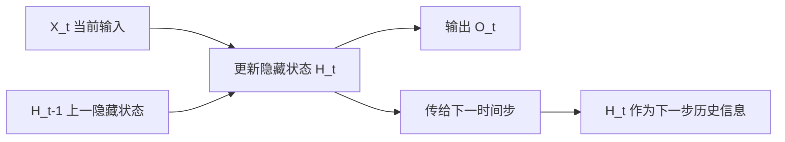

# 第 8 章：RNN 基础

## 1. 本节重难点

### 1.1 RNN 的核心思想

RNN 处理序列时，不是给每个时间步准备一套新参数，而是所有时间步共享同一套参数。

真正随时间变化的是隐藏状态：

$$
H_t = \phi(X_t W_{xh} + H_{t-1}W_{hh} + b_h)
$$

输出为：

$$
O_t = H_t W_{hq} + b_q
$$

其中：

1. $X_t$：当前时间步输入。
2. $H_{t-1}$：上一个时间步的隐藏状态。
3. $H_t$：新的隐藏状态。
4. $O_t$：当前时间步输出。

---

### 1.2 隐藏状态的作用

隐藏状态是 RNN 记忆历史信息的核心。

每一步都做两件事：

1. 用当前输入和旧隐藏状态更新出新隐藏状态。
2. 用新隐藏状态预测当前输出。

所以 RNN 能处理序列，是因为：

> 参数共享负责学习通用规则，隐藏状态负责携带历史上下文。

---

### 1.3 矩阵计算的等价写法

下面两种写法等价：

$$
XW_{xh} + HW_{hh}
$$

也可以拼接后一次矩阵乘法：

$$
[X,H]
\begin{bmatrix}
W_{xh} \\
W_{hh}
\end{bmatrix}
$$

这说明 RNN 的隐藏层本质上就是“当前输入 + 历史状态”的线性变换，再接激活函数。

---

## 2. 核心流程图

---

## 3. 最容易错的点

1. RNN 不是每个时间步一套参数，而是所有时间步共享参数。
2. 随时间变化的是隐藏状态，不是权重矩阵。
3. 隐藏状态不是输出本身，而是模型内部保存的历史摘要。
4. RNN 的“循环”不是代码循环这么简单，而是状态沿时间传递。
5. 反向传播会沿时间展开，所以叫通过时间反向传播。

---

## 4. 本节必须记住

RNN 的一句话理解：

> 当前输入 + 过去状态 = 新状态；新状态再产生当前输出。

