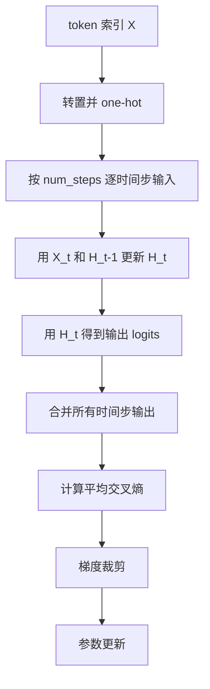

# 第 8 章：从零实现 RNN

## 1. 本节重难点

### 1.1 输入形状和 one-hot

原始输入通常是 token 索引，形状是：

```text
(batch_size, num_steps)
```

RNN 要按时间步推进，所以代码会先转置，再做 one-hot：

```text
(num_steps, batch_size, vocab_size)
```

这里：

1. `num_steps`：时间步数量。
2. `batch_size`：并行训练的序列条数。
3. `vocab_size`：词表大小，也是 one-hot 向量长度。

one-hot 的含义是：当前 token 对应的位置为 1，其他位置为 0。

```text
token = 2, vocab_size = 5
one-hot = [0, 0, 1, 0, 0]
```

这样模型就能把离散 token 变成向量输入。

---

### 1.2 RNN 参数和状态更新

从零实现 RNN 的核心参数：

1. $W_{xh}$：输入到隐藏层。
2. $W_{hh}$：上一隐藏状态到当前隐藏状态。
3. $b_h$：隐藏层偏置。
4. $W_{hq}$：隐藏层到输出层。
5. $b_q$：输出层偏置。

核心公式：

$$
H_t = \tanh(X_tW_{xh} + H_{t-1}W_{hh} + b_h)
$$

$$
Y_t = H_tW_{hq} + b_q
$$

注意：通常只有隐藏状态更新处使用激活函数，输出层得到的是 logits，后面交给交叉熵损失。

---

### 1.3 为什么输出要合并

每个时间步都要预测下一个 token，所以一个 batch 里其实有：

$$
batch\_size \times num\_steps
$$

个预测任务。

因此输出会把时间步和 batch 合并：

```text
(num_steps * batch_size, vocab_size)
```

标签也会展平成对应长度，这样可以一次计算所有时间步的交叉熵损失。

---

### 1.4 交叉熵损失和 one-hot 标签

语言模型每个时间步的任务是：预测下一个 token 是词表中的哪一个。

模型输出的是整个词表上的 logits：

```text
[logit_1, logit_2, ..., logit_vocab]
```

经过 softmax 后得到每个 token 的概率。真实标签可以理解成一个 one-hot 向量，只有正确 token 的位置是 1。

交叉熵衡量的是真实分布 $p$ 和模型预测分布 $q$ 之间的差异：

$$
H(p, q) = -\sum_i p_i \log q_i
$$

在分类任务里，真实标签 $p$ 是 one-hot：

```text
真实 token = machine
p = [0, 0, 1, 0, 0]
q = [0.1, 0.2, 0.6, 0.05, 0.05]
```

因为 one-hot 里只有正确类别的位置是 1，其他位置都是 0，所以：

$$
H(p, q)
= -\sum_i p_i \log q_i
= -\log q_{\text{正确 token}}
$$

也就是说，损失最终等价于：

$$
loss = -\log P_{\text{model}}(\text{正确的下一个 token})
$$

它不是直接用“模型预测正确率”，而是用模型给正确 token 分配的概率。这个概率越接近 1，损失越接近 0；概率越小，损失越大。

注意：PyTorch 的 `CrossEntropyLoss` 通常接收整数类别标签，不需要手动把标签转成 one-hot；但理解上可以把它看成 one-hot 标签对应的交叉熵。

一个 batch 里不是只有一个预测任务，而是有：

$$
batch\_size \times num\_steps
$$

个预测任务。比如 `batch_size = 32`，`num_steps = 5`，就有 160 个位置都要预测下一个 token。

训练时会先计算这 160 个预测任务各自的交叉熵损失，再求平均：

$$
L = \frac{1}{N}\sum_{j=1}^{N} -\log P_{\text{model}}(y_j \mid x_j)
$$

其中：

$$
N = batch\_size \times num\_steps
$$

最后用这个平均损失反向传播更新参数。用平均损失的原因是：损失大小不应该因为预测任务数量更多就变大，平均后才能公平比较不同 batch 或不同序列长度下的训练效果。

---

### 1.5 预测时的状态预热

生成文本时，隐藏状态一开始通常是零状态，但不能直接空状态预测完整句子。

正确做法是用前缀 `prefix` 逐步喂给 RNN，让隐藏状态先包含上下文：

```text
prefix: "time traveller "
```

模型先读入这些已知字符更新隐藏状态，然后再开始生成后续字符。

这就是“预热”的含义。

---

### 1.6 梯度裁剪

RNN 沿时间反向传播，容易梯度爆炸。

梯度裁剪做的是：如果梯度范数超过阈值 $\theta$，就按比例缩小：

$$
g \leftarrow \frac{\theta}{\|g\|}g
$$

它只缩放梯度大小，不改变梯度方向。

为什么不用单纯调小学习率？

1. 学习率太小会让正常梯度也几乎不更新。
2. 梯度裁剪只处理异常大的梯度。
3. 它主要防止梯度爆炸，不解决梯度消失。

---

### 1.7 困惑度

困惑度衡量模型预测下一个 token 的不确定性：

$$
perplexity = \exp(\text{平均交叉熵损失})
$$

直觉：

1. 困惑度为 1：模型几乎完全确定答案。
2. 困惑度为 4：平均相当于在 4 个候选项里选择。
3. 困惑度越低，语言模型越好。

这里必须用平均交叉熵损失，因为总损失会随预测任务数量变大，不能公平比较不同 batch 或不同序列长度的数据。

---

## 2. 核心流程图



---

## 3. 最容易错的点

1. `num_steps` 是时间步长度，不是特征数。
2. RNN 的输入不是普通连续特征，而是 token 索引经过 one-hot 后的向量。
3. 权重参数在所有时间步共享，变化的是隐藏状态。
4. 输出合并不是丢掉时间信息，而是为了统一计算所有预测任务的损失。
5. 交叉熵是 $-\sum_i p_i\log q_i$，因为真实标签是 one-hot，所以最终只剩正确 token 那一项。
6. PyTorch 的 `CrossEntropyLoss` 标签通常是类别索引，不需要手动转 one-hot。
7. 预测时的零状态会被 prefix 预热，不是永远用空状态生成。
8. 随机采样通常重置隐藏状态；顺序采样可以保留隐藏状态，但要 `detach` 防止计算图无限延伸。
9. 梯度裁剪防止梯度爆炸，不是防止梯度消失。
10. 困惑度来自平均交叉熵，不应该用总损失直接比较。

---

## 4. 本节必须记住

从零实现 RNN 的主线是：

> one-hot 输入，按时间更新隐藏状态，每个时间步预测下一个 token，对所有预测任务的交叉熵求平均后反向传播，用困惑度衡量平均不确定性，并用梯度裁剪稳定训练。
