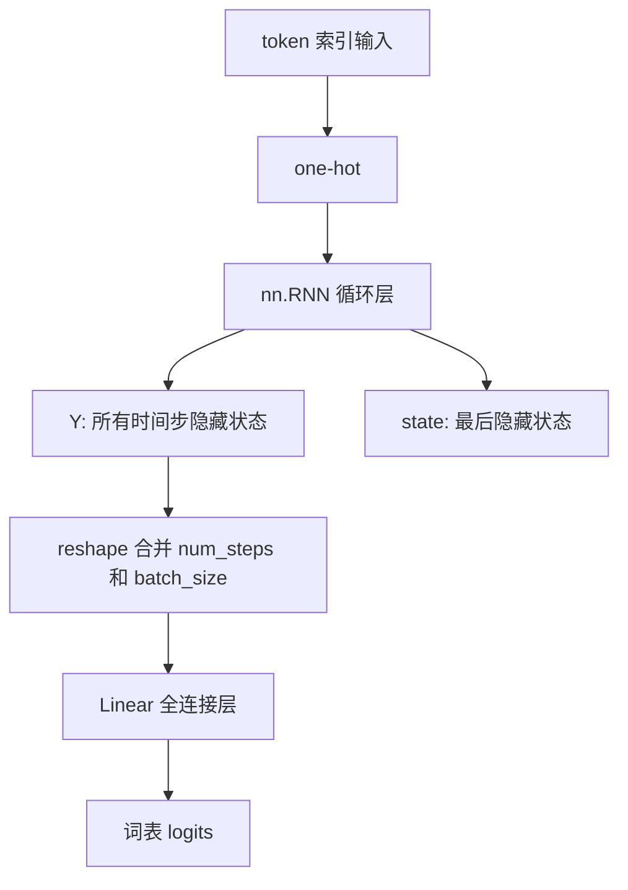

# 第 8 章：RNN 简洁实现

## 1. 本节重难点

### 1.1 PyTorch RNN 做了什么

`nn.RNN` 帮我们实现了循环层，不需要再手写：

$$
H_t = \tanh(X_tW_{xh} + H_{t-1}W_{hh} + b_h)

$$

调用后得到：

```python
Y, state = rnn_layer(X, state)
```

其中：

1. `Y`：所有时间步的隐藏状态序列。
2. `state`：最后一个时间步的隐藏状态。

注意：`Y` 不是最终预测结果，它只是 RNN 层输出的隐藏表示。

---

### 1.2 为什么还要自己接线性层

语言模型最终要预测下一个 token，所以输出维度必须是词表大小：

$$
vocab\_size

$$

但 `nn.RNN` 输出的是隐藏状态，最后一维是：

$$
num\_hiddens

$$

所以还需要自己定义全连接层：

```python
self.linear = nn.Linear(num_hiddens, vocab_size)
```

作用是：

$$
隐藏状态 \rightarrow 词表 logits

$$

也就是把每个时间步的隐藏状态转换成对整个词表的预测分数。

---

### 1.3 单向和双向 RNN 的区别

如果是单向 RNN：

```text
num_directions = 1
linear 输入维度 = num_hiddens
```

如果是双向 RNN：

```text
num_directions = 2
linear 输入维度 = num_hiddens * 2
```

原因是双向 RNN 会同时保留正向和反向两个方向的隐藏状态，所以最后一维会翻倍。

通用写法：

$$
linear\_in = num\_hiddens \times num\_directions

$$

---

### 1.4 输出为什么要 reshape

RNN 的 `Y` 保存了所有时间步、所有样本的隐藏状态：

```text
(num_steps, batch_size, num_hiddens * num_directions)
```

线性层 `nn.Linear` 期望输入格式是二维张量：

```text
(样本数, 特征数)
```

这里的“特征数”就是隐藏状态维度：

```text
num_hiddens * num_directions
```

而每一个时间步、每一个 batch 样本的隐藏状态，都是一个独立的下一个 token 预测任务。

所以要把前两维合并：

```text
(num_steps * batch_size, num_hiddens * num_directions)
```

再送入线性层：

```text
(num_steps * batch_size, vocab_size)
```

这和从零实现 RNN 时一样，本质上是把 `num_steps * batch_size` 个独立预测任务一次性送入全连接层。

---

## 2. 核心流程图



---

## 3. 最容易错的点

1. `nn.RNN` 输出的 `Y` 不是词表预测结果，而是隐藏状态序列。
2. 最终的词表 logits 要自己接 `nn.Linear` 得到。
3. 单向 RNN 的线性层输入维度是 `num_hiddens`。
4. 双向 RNN 的线性层输入维度是 `num_hiddens * 2`。
5. `state` 是最后时间步的隐藏状态，`Y` 包含所有时间步的隐藏状态。
6. `reshape` 是因为线性层需要二维输入：`(样本数, 特征数)`。
7. `num_hiddens * num_directions` 是隐藏状态的特征维度，不是预测任务数量。

---

## 4. 本节必须记住

简洁实现不是改变 RNN 原理，而是让 PyTorch 帮我们算循环层。

> `nn.RNN` 负责产生隐藏状态，`nn.Linear` 负责把隐藏状态变成词表预测。
