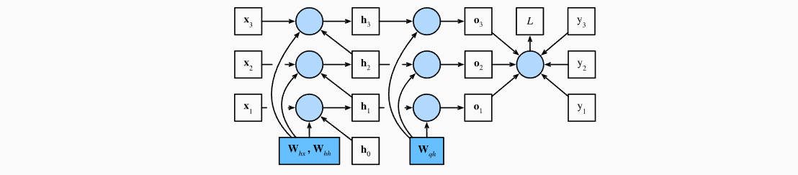
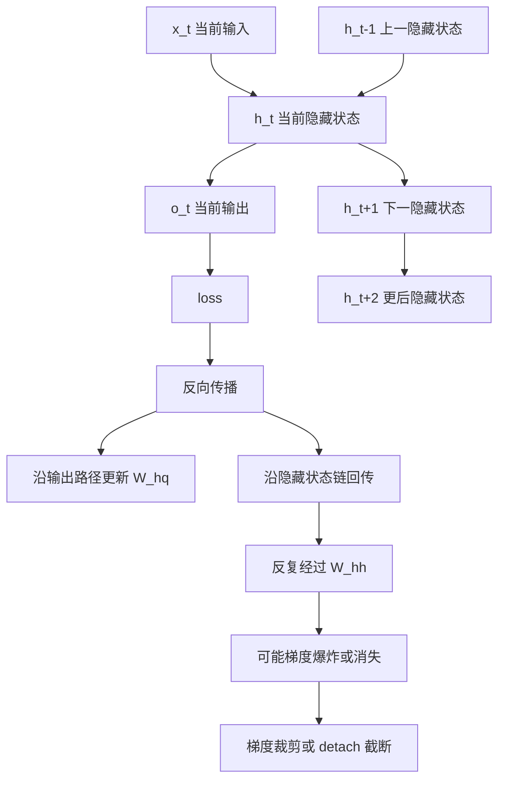

# 第 8 章：通过时间反向传播 BPTT

## 1. 本节重难点

### 1.1 BPTT 是什么

BPTT，全称是 Backpropagation Through Time，意思是“沿时间展开后的反向传播”。

RNN 在每个时间步都使用同一套参数：

$$
h_t = f(x_t, h_{t-1}; W_{xh}, W_{hh}, b_h)
$$

$$
o_t = g(h_t; W_{hq}, b_q)
$$

虽然参数只有一套，但它会在多个时间步反复参与计算。反向传播时，损失会沿着时间步一路往前追溯，所以叫“通过时间反向传播”。

---

### 1.2 为什么 `W_hh` 最关键

`W_hh` 是隐藏状态到隐藏状态的参数：

$$
h_{t-1} \rightarrow h_t
$$

它不仅影响当前时间步的隐藏状态，还会通过隐藏状态继续影响后面的时间步：

$$
h_1 \rightarrow h_2 \rightarrow h_3 \rightarrow \cdots
$$

所以计算梯度时，`W_hh` 的影响有两类路径：

1. 当前时间步的直接影响。
2. 通过过去隐藏状态传递到当前和未来的间接影响。

这就是 RNN 梯度比普通前馈网络更复杂的地方。

---

### 1.3 隐藏状态梯度的递推公式

设总损失为：

$$
L = \sum_{t=1}^{T} l_t
$$

这里要区分两个递推方向。

第一种是在反向传播里问：

> 总损失 $L$ 对当前隐藏状态 $h_t$ 的梯度是多少？

这时梯度是从未来时间步往当前时间步传回来的，所以会出现 $h_{t+1}$。

当前隐藏状态 $h_t$ 对总损失的影响有两条路径：

1. 直接影响当前输出 $o_t$，从而影响当前损失 $l_t$。
2. 影响下一步隐藏状态 $h_{t+1}$，再继续影响后面的损失。

所以隐藏状态的梯度可以写成递推形式：

$$
\frac{\partial L}{\partial h_t}
=
\frac{\partial l_t}{\partial h_t}
+
\frac{\partial L}{\partial h_{t+1}}
\frac{\partial h_{t+1}}{\partial h_t}
$$

这就是 BPTT 的核心：当前层的梯度不只来自当前损失，还来自未来时间步通过隐藏状态链传回来的梯度。

第二种是在前向依赖里问：

> 当前隐藏状态 $h_t$ 是怎么由过去的 $h_{t-1}$ 和参数递推得到的？

这时才会写到 $h_{t-1}$：

$$
h_t = f(x_tW_{xh} + h_{t-1}W_{hh} + b_h)
$$

如果研究 $h_t$ 对 `W_hh` 的依赖，可以写成：

$$
\frac{\partial h_t}{\partial W_{hh}}
=
\left.\frac{\partial h_t}{\partial W_{hh}}\right|_{\text{直接项}}
+
\frac{\partial h_t}{\partial h_{t-1}}
\frac{\partial h_{t-1}}{\partial W_{hh}}
$$

这里的两项就是：

1. 直接项：当前时间步的 `W_hh` 直接参与 $h_t$ 计算。
2. 递推项：`W_hh` 先影响过去的隐藏状态 $h_{t-1}$，再通过 $h_{t-1}$ 影响 $h_t$。

对 `W_hh` 来说，它在每个时间步都参与隐藏状态转移：

$$
h_t = f(x_tW_{xh} + h_{t-1}W_{hh} + b_h)
$$

因此它的总梯度是所有时间步贡献的累加：

$$
\frac{\partial L}{\partial W_{hh}}
=
\sum_{t=1}^{T}
\frac{\partial L}{\partial h_t}
\frac{\partial h_t}{\partial W_{hh}}
$$

其中 $\frac{\partial L}{\partial h_t}$ 本身又由上面的递推式决定，所以 `W_hh` 的梯度会包含沿时间不断往前传的长链。

---

### 1.4 梯度爆炸和梯度消失的根源

BPTT 会产生一条很长的链式求导路径：

$$
\frac{\partial h_t}{\partial h_{t-1}}
\frac{\partial h_{t-1}}{\partial h_{t-2}}
\cdots
\frac{\partial h_1}{\partial h_0}
$$

在 RNN 里，这条链中会反复出现与 `W_hh` 相关的项。

如果这些项的整体尺度长期大于 1，梯度会越乘越大，形成梯度爆炸。

如果这些项的整体尺度长期小于 1，梯度会越乘越小，形成梯度消失。

所以梯度爆炸/消失的核心原因不是某一个时间步的计算，而是隐藏状态沿时间反复传递造成的长链乘法。

---

### 1.5 `W_xh` 和偏置也会经过长链

`W_xh` 和偏置 $b_h$ 也参与每个隐藏状态的计算：

$$
h_t = f(x_tW_{xh} + h_{t-1}W_{hh} + b_h)
$$

所以它们当然也会被反向传播更新。

它们的梯度也可以写成所有时间步贡献的累加：

$$
\frac{\partial L}{\partial W_{xh}}
=
\sum_{t=1}^{T}
\frac{\partial L}{\partial h_t}
\frac{\partial h_t}{\partial W_{xh}}
$$

$$
\frac{\partial L}{\partial b_h}
=
\sum_{t=1}^{T}
\frac{\partial L}{\partial h_t}
\frac{\partial h_t}{\partial b_h}
$$

关键点是：这里的 $\frac{\partial L}{\partial h_t}$ 仍然包含隐藏状态之间的递推长链。

也就是说，`W_xh` 和 `b_h` 的梯度也会受到梯度爆炸/消失影响，但原因不是它们自己在做状态转移，而是反向传播为了到达对应的 $h_t$，必须先穿过：

$$
\frac{\partial h_T}{\partial h_{T-1}}
\frac{\partial h_{T-1}}{\partial h_{T-2}}
\cdots
$$

这条隐藏状态链。

重点区别是：

1. `W_xh` 主要表示当前输入如何影响当前隐藏状态。
2. `b_h` 是当前隐藏状态计算中的偏置项。
3. `W_hh` 才是隐藏状态如何沿时间传递的核心参数。

因此，研究 BPTT 中的梯度爆炸/消失时，重点通常放在 `W_hh` 和隐藏状态链：

$$
h_{t-k} \rightarrow \cdots \rightarrow h_{t-1} \rightarrow h_t
$$

`W_xh` 和偏置的梯度也会受到这条隐藏状态长链影响，但它们本身不是时间状态转移的主要来源。

---

### 1.6 梯度裁剪和截断

为了解决长链带来的训练不稳定，常用两种方法：

1. 梯度裁剪：当梯度范数太大时，把梯度缩放到阈值以内，主要防止梯度爆炸。
2. 截断 BPTT：只向前反传有限步，常见实现是对隐藏状态 `detach`，防止计算图无限延伸。

`detach` 的含义是：保留隐藏状态的数值，但切断它之前的计算图。

这样模型仍然能把状态传到下一个 batch，但反向传播不会无限追溯到很久以前。

---

## 2. 核心流程图

---

## 3. 最容易错的点

1. BPTT 不是一种新模型，而是 RNN 沿时间展开后的反向传播。
2. RNN 参数共享，所以同一个 `W_hh` 会在很多时间步重复参与计算。
3. $\partial L/\partial h_t$ 有递推结构：当前损失的梯度 + 未来隐藏状态传回来的梯度。
4. 梯度爆炸/消失主要来自隐藏状态链上的反复相乘。
5. `W_xh` 和偏置也会受到长链影响，但它们不是状态转移长链的核心参数。
6. 梯度裁剪主要解决梯度爆炸，不解决梯度消失。
7. `detach` 不是清空隐藏状态，而是切断隐藏状态之前的计算图。

---

## 4. 本节必须记住

BPTT 的核心矛盾是：

> RNN 要靠隐藏状态传递历史信息，但这也让梯度沿时间形成很长的链。

`W_hh` 是理解这条长链的关键，因为它控制隐藏状态如何从上一个时间步传到下一个时间步。

最重要的一句话：

> 正向看：$h_t$ 如何由当前输入 $x_t$ 和过去隐藏状态 $h_{t-1}$ 推导出来。反向看：$h_t$ 对损失函数的贡献来自两部分，一是影响当前损失，二是通过影响未来隐藏状态继续影响未来损失。
