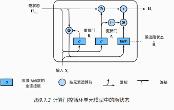
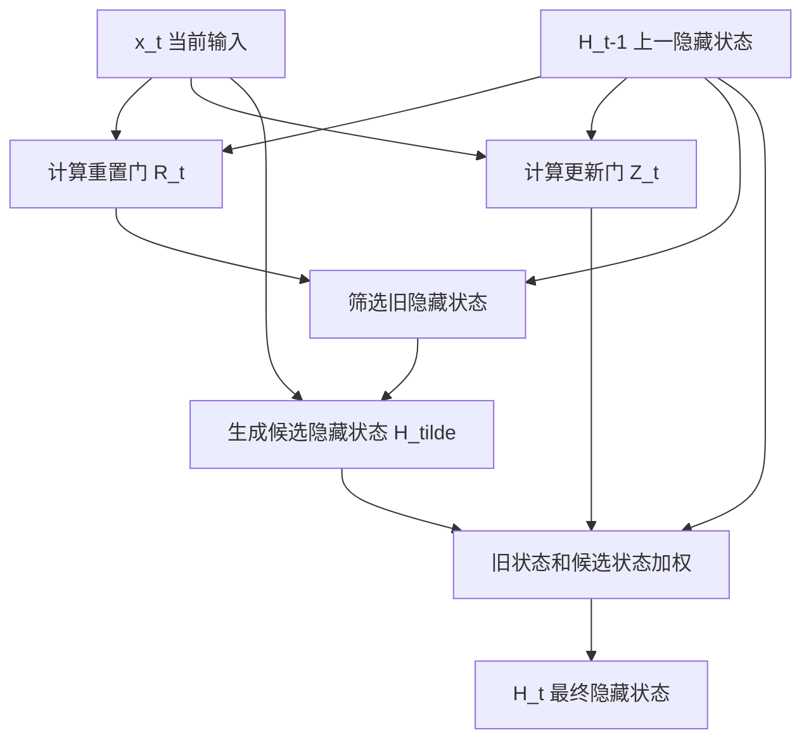

# 第 9 章：门控循环单元 GRU

## 1. 本节重难点

### 1.1 GRU 要解决什么问题

普通 RNN 的隐藏状态更新是：

$$
H_t = \phi(X_tW_{xh} + H_{t-1}W_{hh} + b_h)
$$

它的问题是：每个时间步都会用当前输入和上一隐藏状态重新生成一个新的隐藏状态，但模型本身没有显式机制判断：

1. 哪些过去信息应该继续保留。
2. 哪些过去信息可以暂时忽略。
3. 当前新信息应该写入多少。

GRU，全称是 Gated Recurrent Unit，核心就是给 RNN 加上门控机制，让模型自己学习“保留多少旧信息、写入多少新信息”。



一句话理解：

> GRU 不是每一步都强行覆盖隐藏状态，而是用门控参数学出一种可训练的加权更新方式。

---

### 1.2 重置门 Reset Gate

重置门一般记作 $R_t$：

$$
R_t = \sigma(X_tW_{xr} + H_{t-1}W_{hr} + b_r)
$$

其中 $\sigma$ 是 sigmoid 函数，所以 $R_t$ 中每个位置的值都在 0 到 1 之间。

重置门的维度和隐藏状态 $H_{t-1}$ 相同，因此它可以逐元素控制上一时刻隐藏状态：

$$
R_t \odot H_{t-1}
$$

直觉上：

1. 如果 $R_t$ 某个位置接近 1，说明对应的过去信息要参与候选隐藏状态的计算。
2. 如果 $R_t$ 某个位置接近 0，说明对应的过去信息可以暂时忽略。

然后 GRU 用被重置门筛选后的旧隐藏状态生成候选隐藏状态：

$$
\tilde{H}_t =
\tanh(X_tW_{xh} + (R_t \odot H_{t-1})W_{hh} + b_h)
$$

所以重置门真正控制的是：

> 在生成候选隐藏状态 $\tilde{H}_t$ 时，旧隐藏状态 $H_{t-1}$ 还要参与多少。

它更偏向“短时间上下文是否还相关”的判断。如果当前输入需要模型暂时忘掉一部分过去状态，重置门就会把对应位置压低。

---

### 1.3 更新门 Update Gate

更新门一般记作 $Z_t$：

$$
Z_t = \sigma(X_tW_{xz} + H_{t-1}W_{hz} + b_z)
$$

它同样是一个和隐藏状态大小相同的门控矩阵，值也在 0 到 1 之间。

更新门控制最终隐藏状态 $H_t$ 是更接近旧状态，还是更接近新候选状态：

$$
H_t = Z_t \odot H_{t-1} + (1 - Z_t) \odot \tilde{H}_t
$$

这个公式的本质是加权平均：

1. $Z_t \odot H_{t-1}$：保留多少旧隐藏状态。
2. $(1 - Z_t) \odot \tilde{H}_t$：写入多少新的候选隐藏状态。

如果 $Z_t$ 接近 1，最终状态更像 $H_{t-1}$，说明过去信息更重要。  
如果 $Z_t$ 接近 0，最终状态更像 $\tilde{H}_t$，说明当前新信息更重要。

注意：有些资料会把 $Z_t$ 的方向定义反过来，写成：

$$
H_t = (1 - Z_t) \odot H_{t-1} + Z_t \odot \tilde{H}_t
$$

这只是符号约定不同。真正要记住的是：

> 更新门决定旧状态和新候选状态在最终隐藏状态里各占多少。

---

### 1.4 两个门的分工

| 门 | 作用位置 | 解决的问题 | 一句话理解 |
|---|---|---|---|
| 重置门 $R_t$ | 生成候选隐藏状态 $\tilde{H}_t$ 之前 | 旧信息是否参与当前候选状态计算 | 先决定“过去哪些信息先拿来参考” |
| 更新门 $Z_t$ | 生成最终隐藏状态 $H_t$ 时 | 旧状态和新状态最终怎么加权 | 再决定“最终保留旧的多一点，还是写入新的多一点” |

不要把重置门理解成最终的保留门。它不是直接决定 $H_t$ 里保留多少旧状态，而是先影响候选状态 $\tilde{H}_t$ 的生成。

---

### 1.5 为什么 GRU 能缓解梯度消失

普通 RNN 中，隐藏状态每一步都要经过矩阵乘法和非线性函数：

$$
H_{t-1} \rightarrow H_t \rightarrow H_{t+1} \rightarrow \cdots
$$

反向传播时，梯度会沿着这条长链不断相乘，所以容易梯度消失或梯度爆炸。

GRU 的更新门提供了一条更接近恒等映射的路径：

$$
H_t = Z_t \odot H_{t-1} + (1 - Z_t) \odot \tilde{H}_t
$$

当 $Z_t$ 接近 1 时：

$$
H_t \approx H_{t-1}
$$

这意味着旧隐藏状态可以比较直接地传到下一步。反向传播时，梯度也更容易沿着这条“保留旧状态”的路径传回去。

所以更准确的说法是：

> GRU 通过更新门让隐藏状态可以近似保持不变，从而缓解长序列中的梯度消失问题。

但 GRU 不是彻底解决梯度爆炸。梯度爆炸通常还需要梯度裁剪等方法控制。

---

## 2. 核心流程图



机制链可以压缩成：

```text
当前输入 X_t + 上一隐藏状态 H_{t-1}
        ↓
重置门 R_t：决定旧信息怎么参与候选状态
        ↓
候选隐藏状态 H_tilde：生成新的可能状态
        ↓
更新门 Z_t：决定旧状态和新候选状态的比例
        ↓
最终隐藏状态 H_t
```

---

## 3. 最容易错的点

1. 重置门不是最终决定保留多少旧隐藏状态，它主要影响候选隐藏状态 $\tilde{H}_t$ 的生成。
2. 更新门才是最终加权的关键，它决定 $H_{t-1}$ 和 $\tilde{H}_t$ 谁占得更多。
3. 不要死背 $Z_t$ 一定乘旧状态还是乘新状态，不同资料可能约定相反，要看公式定义。
4. sigmoid 输出 0 到 1，不是为了分类，而是为了做逐元素门控比例。
5. GRU 能缓解梯度消失，是因为更新门允许 $H_t \approx H_{t-1}$，形成比较直接的状态传递路径。
6. GRU 不能保证完全解决梯度爆炸，训练时仍然可能需要梯度裁剪。

---

## 4. 本节必须记住

GRU 的核心不是多了几个公式，而是多了“控制信息流”的能力：

> 重置门决定旧信息如何参与候选状态，更新门决定旧状态和新候选状态最终各占多少。

最重要的一句话：

> GRU 把隐藏状态更新变成可训练的加权选择：该记住的旧信息可以继续传下去，该写入的新信息也可以按比例进入当前状态。
