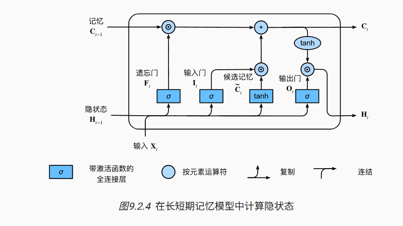
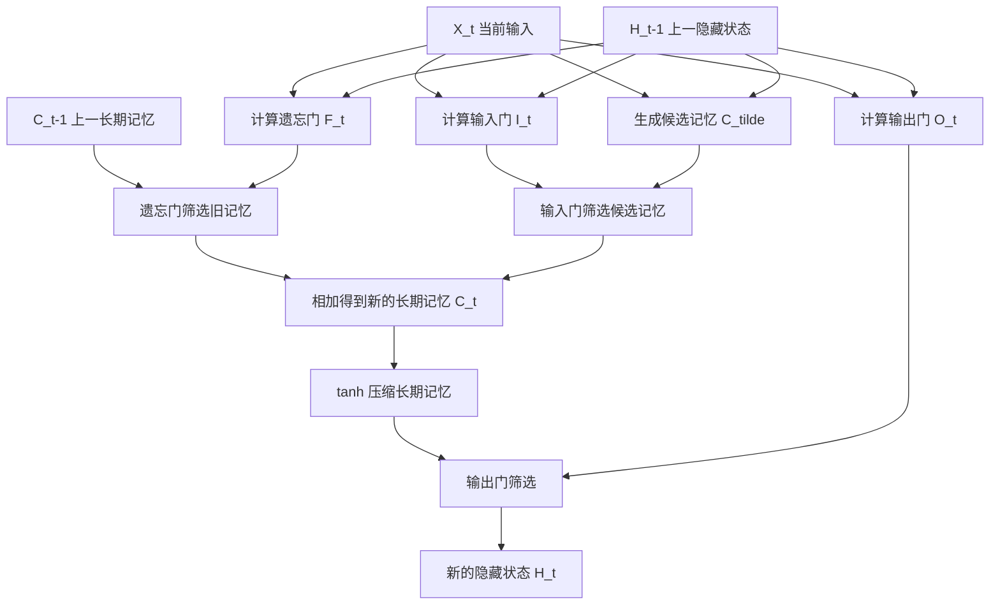

# 第 9 章：长短期记忆网络 LSTM

## 1. 本节重难点

### 1.1 LSTM 要解决什么问题

普通 RNN 只有一个隐藏状态 $H_t$，它既要负责保存历史信息，又要负责对当前时间步输出有用的信息。问题是：这两个任务混在一起后，模型很难长期稳定地保存重要信息。

LSTM，全称是 Long Short-Term Memory，核心改进是把状态拆成两条线：

1. **记忆细胞** $C_t$：更像长期记忆，负责沿时间保存重要信息。
2. **隐藏状态** $H_t$：更像当前上下文摘要，负责暴露给当前输出和下一步门控计算。

一句话理解：

> LSTM 不是只用一个隐藏状态硬记所有东西，而是把“长期记忆”和“当前要拿出来用的摘要”分开维护。



---

### 1.2 $C_t$ 和 $H_t$ 的关键区别


| 对比               | 记忆细胞$C_t$                    | 隐藏状态$H_t$                    |
| ------------------ | -------------------------------- | -------------------------------- |
| **本质**           | 长期记忆主通道                   | 当前时间步的上下文摘要           |
| **作用**           | 保存跨很多时间步的重要信息       | 给当前输出和下一步门控计算使用   |
| **信息范围**       | 可以包含更长期、更完整的历史信息 | 更偏向当前任务需要暴露出来的部分 |
| **为什么需要分离** | 避免长期记忆每一步都被强行覆盖   | 让模型只把当前需要的信息拿出来   |

可以这样理解：

> $C_t$ 像长期记忆库，里面可以保留很多重要信息；$H_t$ 像当前问题下从记忆库里提取出来的摘要，不一定包含全部长期记忆。

这也是为什么 LSTM 需要输出门：不是所有 $C_t$ 里的长期信息都应该直接暴露成 $H_t$，输出门负责决定哪些记忆对当前问题真正有用。

---

### 1.3 LSTM 的三道门和候选记忆

LSTM 有三道门：

1. 遗忘门 $F_t$
2. 输入门 $I_t$
3. 输出门 $O_t$

另外还有一个候选记忆 $\tilde{C}_t$。注意：$\tilde{C}_t$ 不是一道门，它是当前时间步准备写入记忆细胞的新内容。

三道门都由当前输入 $X_t$ 和上一隐藏状态 $H_{t-1}$ 共同决定：

$$
F_t = \sigma(X_tW_{xf} + H_{t-1}W_{hf} + b_f)

$$

$$
I_t = \sigma(X_tW_{xi} + H_{t-1}W_{hi} + b_i)

$$

$$
O_t = \sigma(X_tW_{xo} + H_{t-1}W_{ho} + b_o)

$$

候选记忆为：

$$
\tilde{C}_t = \tanh(X_tW_{xc} + H_{t-1}W_{hc} + b_c)

$$

这里 $\sigma$ 输出 0 到 1，用来表示“保留多少、写入多少、输出多少”；$\tanh$ 输出候选内容本身。

---

### 1.4 LSTM 的状态更新流程

第一步：遗忘门决定旧长期记忆保留多少：

$$
F_t \odot C_{t-1}

$$

如果 $F_t$ 某些位置接近 1，说明对应旧记忆继续保留；如果接近 0，说明对应旧记忆可以遗忘。

第二步：输入门决定当前候选记忆写入多少：

$$
I_t \odot \tilde{C}_t

$$

$\tilde{C}_t$ 表示当前时间步根据 $X_t$ 和 $H_{t-1}$ 生成的“有可能写入的新信息”，输入门 $I_t$ 决定这些新信息真正写入多少。

第三步：旧记忆和新记忆加权合成新的长期记忆：

$$
C_t = F_t \odot C_{t-1} + I_t \odot \tilde{C}_t

$$

这个公式的本质是：

> 新的长期记忆 = 旧长期记忆中该保留的部分 + 当前候选记忆中该写入的部分。

第四步：输出门决定长期记忆中哪些信息暴露成当前隐藏状态：

$$
H_t = O_t \odot \tanh(C_t)

$$

注意这里不是直接把 $C_t$ 输出，而是先经过 $\tanh$ 压缩，再由输出门筛选。

---

### 1.5 为什么门要由 $X_t$ 和 $H_{t-1}$ 计算

每一道门本质上都在回答一个问题：

1. 现在来了什么新输入？
2. 之前已经暴露出来的上下文摘要是什么？
3. 基于这两者，哪些旧信息该忘、哪些新信息该写、哪些记忆该输出？

所以门需要同时看：

- $X_t$：当前输入，代表新信息。
- $H_{t-1}$：上一时间步暴露出来的上下文摘要，代表当前任务下已经用到的历史信息。

这也是 LSTM 设计聪明的地方：门控不是固定规则，而是可训练的判断器。模型会根据当前输入和过去上下文，自己学习信息流应该怎么开关。

---

### 1.6 为什么门通常用 $H_{t-1}$，不是直接用 $C_{t-1}$

关键还是 $C_t$ 和 $H_t$ 的分工：

- $C_{t-1}$ 是长期记忆主通道，负责尽量稳定地保存信息。
- $H_{t-1}$ 是从长期记忆中暴露出来的上下文摘要，更适合参与当前决策。

如果每一道门都直接依赖完整的 $C_{t-1}$，长期记忆就更容易和当前控制逻辑混在一起。LSTM 用 $H_{t-1}$ 做门控输入，相当于让“当前可见的历史摘要”来参与判断，同时让 $C_{t-1}$ 保持一条更干净的长期记忆通道。

注意：有些 LSTM 变体会让门看到 $C_{t-1}$，这类做法叫 peephole connection。但标准 LSTM 的主要门控输入是 $X_t$ 和 $H_{t-1}$。

---

### 1.7 为什么 LSTM 能缓解梯度消失

普通 RNN 的隐藏状态每一步都要经过矩阵乘法和非线性函数，梯度沿时间反传时会不断相乘，所以容易梯度消失或梯度爆炸。

LSTM 的关键是 $C_t$ 有一条加法形式的记忆主通道：

$$
C_t = F_t \odot C_{t-1} + I_t \odot \tilde{C}_t

$$

当遗忘门 $F_t$ 接近 1、输入门 $I_t$ 接近 0 时：

$$
C_t \approx C_{t-1}

$$

这时长期记忆可以比较直接地从上一个时间步传到当前时间步。反向传播时，这条路径也更接近恒等映射，梯度不需要每一步都经过复杂的非线性变换。

所以更准确的说法是：

> LSTM 通过记忆细胞的加法通道和门控保留机制，让长期信息和梯度都更容易沿时间传递。

但 LSTM 主要是缓解梯度消失，不是彻底解决梯度爆炸。梯度爆炸仍然可能发生，训练时通常还需要梯度裁剪。

---

### 1.8 LSTM vs GRU


| 对比         | LSTM                       | GRU                        |
| ------------ | -------------------------- | -------------------------- |
| **状态数量** | 同时维护$C_t$ 和 $H_t$     | 只维护一个隐藏状态$H_t$    |
| **门控数量** | 遗忘门、输入门、输出门     | 重置门、更新门             |
| **记忆分工** | 长期记忆和当前摘要显式分离 | 旧状态和新候选状态直接加权 |
| **复杂度**   | 参数更多，计算更复杂       | 参数更少，结构更简洁       |
| **表达能力** | 对长期记忆控制更细         | 更轻量，很多任务效果也很好 |

LSTM 比 GRU 更复杂很明显：它多维护了一个记忆细胞 $C_t$，并且多了输入门、遗忘门、输出门三套门控。

LSTM 有时更有效的原因在于：

> 它把“长期记忆保存”和“当前隐藏摘要输出”分开了，模型可以更细地控制哪些信息长期保留，哪些信息当前拿出来用。

但不能简单说 LSTM 一定比 GRU 更好。GRU 结构简单、参数少，训练更快，在很多任务上也可能达到相近甚至更好的效果。

---

## 2. 核心流程图



机制链可以压缩成：

```text
当前输入 X_t + 上一隐藏状态 H_{t-1}
        ↓
三道门：遗忘门、输入门、输出门
        ↓
遗忘门筛旧记忆 C_{t-1}
输入门筛候选记忆 C_tilde
        ↓
相加得到新的长期记忆 C_t
        ↓
输出门决定 C_t 中哪些信息暴露成 H_t
```

---

## 3. 最容易错的点

1. LSTM 是三道门：遗忘门、输入门、输出门；候选记忆 $\tilde{C}_t$ 不是门。
2. $C_t$ 是长期记忆主通道，$H_t$ 是当前上下文摘要，不要把两者混成一个隐藏状态。
3. 门通常由 $X_t$ 和 $H_{t-1}$ 计算，不是由完整的 $C_{t-1}$ 直接计算。
4. $C_{t-1}$ 不是经过每一道门，而是主要通过遗忘门进入新的 $C_t$。
5. 输出门不是直接输出 $C_t$，而是 $H_t = O_t \odot \tanh(C_t)$。
6. LSTM 能缓解梯度消失，是因为 $C_t$ 的加法主通道可以让 $C_t \approx C_{t-1}$，不是因为它完全消除了梯度问题。
7. LSTM 不一定永远比 GRU 更好；它更复杂、表达能力更强，但 GRU 更轻量，实际效果取决于任务和数据。

---

## 4. 本节必须记住

LSTM 的核心不是公式多，而是把记忆拆成两层：

> $C_t$ 负责长期保存，$H_t$ 负责当前暴露；三道门负责决定旧记忆保留多少、新信息写入多少、长期记忆输出多少。

最重要的一句话：

> LSTM 用一条更稳定的记忆主通道保存长期信息，再用门控决定什么时候忘、什么时候写、什么时候拿出来用。
