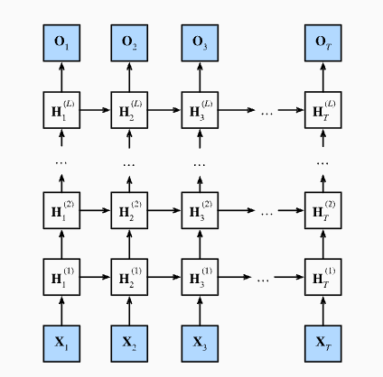
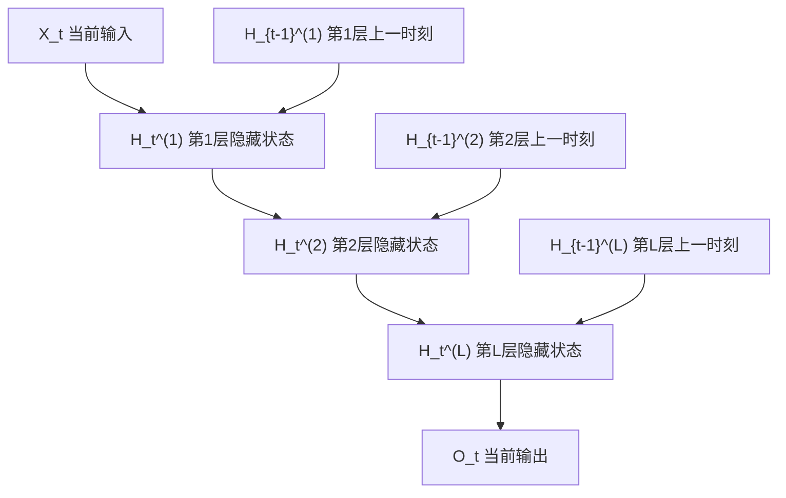

# 第 9 章：深度循环神经网络

## 1. 本节重难点

### 1.1 深度 RNN 要解决什么问题

普通 RNN 在每个时间步只有一层隐藏状态：

$$
H_t = \phi(X_tW_{xh} + H_{t-1}W_{hh} + b_h)

$$

它可以沿时间方向传递历史信息，但每个时间步内部的表示能力比较有限。深度循环神经网络的核心改进是：**在每个时间步把 RNN 的隐藏层堆叠成多层**。

一句话理解：

> 深度 RNN = 时间方向上的循环传递 + 深度方向上的多层特征提取。



---

### 1.2 深度 RNN 的两个方向

深度 RNN 同时有两个方向的信息流：


| 方向         | 含义                                                 | 一句话理解               |
| -------------- | ------------------------------------------------------ | -------------------------- |
| **时间方向** | 同一层中，$H_{t-1}^{(l)}$ 传到 $H_t^{(l)}$           | 每一层自己沿时间记住历史 |
| **深度方向** | 同一时间步中，低层$H_t^{(l-1)}$ 传给高层 $H_t^{(l)}$ | 当前时间步的信息逐层抽象 |

所以不要把深度 RNN 只理解成“RNN 多了几层”。更准确地说：

> 每一层都是一条自己的时间记忆链，同时当前时间步的输出会继续往上层传。

---

### 1.3 每一层的输入是什么

第 1 层直接接收原始输入 $X_t$：

$$
H_t^{(1)} = \phi(X_tW_{xh}^{(1)} + H_{t-1}^{(1)}W_{hh}^{(1)} + b_h^{(1)})

$$

从第 2 层开始，输入不再是原始 $X_t$，而是上一层在当前时间步的隐藏状态：

$$
H_t^{(l)} =
\phi(H_t^{(l-1)}W_{xh}^{(l)} + H_{t-1}^{(l)}W_{hh}^{(l)} + b_h^{(l)})

$$

其中：

1. $H_t^{(l-1)}$：同一时间步、上一层传上来的表示。
2. $H_{t-1}^{(l)}$：同一层、上一时间步传过来的历史状态。
3. $H_t^{(l)}$：第 $l$ 层在当前时间步的新隐藏状态。

这个公式的关键是同时看两条来源：

> 横向看时间：本层上一时刻给我什么历史。纵向看深度：下层当前时刻给我什么表示。

---

### 1.4 深度方向：逐层抽象当前输入

深度方向发生在同一个时间步内部：

```text
X_t → H_t^{(1)} → H_t^{(2)} → ... → H_t^{(L)}
```

第 1 层更接近原始输入，学到的往往是比较浅层的序列特征。越往上，表示越经过多层变换，更可能抽象出高层语义。

可以这样理解：

> 浅层负责把原始输入变成基础特征，深层负责在基础特征上继续提炼更高级的序列表示。

这就是深度 RNN 相比单层 RNN 的主要提升：它不只是沿时间记忆，还能在每个时间步内部做更深的特征抽象。

---

### 1.5 时间方向：每一层都有自己的历史链

时间方向和普通 RNN 一样，隐藏状态仍然会从上一时间步传到当前时间步：

```text
H_{t-1}^{(l)} → H_t^{(l)} → H_{t+1}^{(l)}
```

注意这里不是“隐藏状态不再往后传递信息”，而是：

> 深度 RNN 中每一层都各自沿时间方向传递自己的隐藏状态。

所以如果有 $L$ 层，就相当于有 $L$ 条时间记忆链。每一层既接收本层过去的信息，也接收下层当前的信息。

---

### 1.6 深度 LSTM 中 $C_t$ 和 $H_t$ 怎么传

如果深度 RNN 的基本单元是 LSTM，那么每一层都有自己的记忆细胞和隐藏状态：

$$
C_t^{(l)}, H_t^{(l)}

$$

关键区分：


| 对比                 | 深度方向传给下一层     | 时间方向传给下一时刻             |
| ---------------------- | ------------------------ | ---------------------------------- |
| **传递对象**         | 通常传$H_t^{(l)}$      | 本层传$H_t^{(l)}$ 和 $C_t^{(l)}$ |
| **$C_t$ 是否跨层传** | 不直接作为下一层输入   | 只在同一层沿时间传递             |
| **本质**             | 当前层输出作为上层输入 | 每一层维护自己的长期记忆         |

也就是说，第 $l$ 层的 $H_t^{(l)}$ 会作为第 $l+1$ 层当前时间步的输入，但第 $l$ 层的 $C_t^{(l)}$ 不会直接传给第 $l+1$ 层。

一句话：

> 深度方向上传的是当前层的 hidden state；cell state 主要在每一层内部沿时间方向自己传。

这和你前面理解 LSTM 的 $C_t$ / $H_t$ 分工是连起来的：$C_t$ 是本层长期记忆，$H_t$ 是本层对外暴露的当前摘要。既然要给下一层看，传 $H_t$ 更合理；而 $C_t$ 保持在本层内部维护长期记忆。

---

### 1.7 为什么深度 RNN 更有效

深度 RNN 的优势来自“不同层学习不同层次的信息”：

1. 底层更接近原始输入，适合捕捉局部、基础、浅层特征。
2. 高层接收底层已经处理过的表示，适合提取更抽象、更高级的序列模式。
3. 每一层都有自己的时间状态，所以不同层可以在不同抽象层级上记忆历史。

这和 CNN 中“浅层提边缘、深层提语义”的直觉有点像，只不过深度 RNN 处理的是序列表示：

> 深度方向负责把当前时间步的信息逐层抽象，时间方向负责让每一层都记住自己的历史。

---

## 2. 核心流程图



机制链可以压缩成：

```text
同一时间步：
X_t → 第1层隐藏状态 → 第2层隐藏状态 → ... → 第L层隐藏状态 → 输出

同一层内部：
H_{t-1}^{(l)} → H_t^{(l)} → H_{t+1}^{(l)}
```

---

## 3. 最容易错的点

1. 深度 RNN 不是只把普通 RNN 复制几份，而是同时存在时间方向和深度方向两条信息流。
2. 时间方向上，隐藏状态仍然会往后传递；不是“不再传递信息”。
3. 第 1 层输入是 $X_t$，第 2 层及以上的输入通常是下方上一层的 $H_t$。
4. 深度 LSTM 中，每一层都有自己的 $C_t$ 和 $H_t$。
5. LSTM 的 $C_t$ 主要在同一层沿时间方向传递，不直接作为深度方向输入给下一层。
6. 深度方向上传给下一层的是当前层的隐藏状态 $H_t$，因为它是当前层对外暴露的上下文摘要。
7. 层数更深不一定永远更好，深层模型参数更多、训练更难，也更容易过拟合。

---

## 4. 本节必须记住

深度 RNN 的核心不是把公式写复杂，而是在两个方向上组织序列信息：

> 时间方向负责记住历史，深度方向负责逐层抽象当前表示。

如果是深度 LSTM，还要记住：

> 每一层都有自己的 $C_t$ 和 $H_t$；$C_t$ 在本层内部保存长期记忆，$H_t$ 才作为当前层输出传给下一层。
