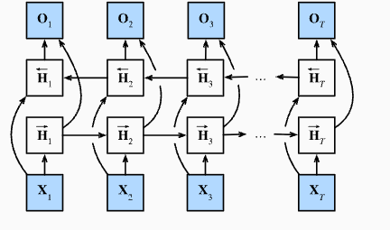
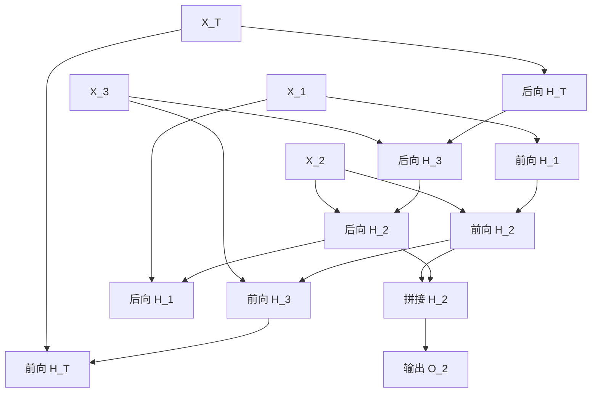

# 第 9 章：双向循环神经网络

## 1. 本节重难点

### 1.1 双向 RNN 要解决什么问题

普通 RNN 的隐藏状态是按照时间从左到右传递的：

$$
H_t = \phi(X_tW_{xh} + H_{t-1}W_{hh} + b_h)
$$

所以 $H_t$ 主要压缩的是 $X_1$ 到 $X_t$ 的过去信息。问题是，很多序列任务里，当前时刻的判断不只依赖过去，也依赖未来。

比如判断一句话中某个词的含义，前面的词有用，后面的词也可能决定它到底是什么意思。

**本质**：双向 RNN 不是改变一个 RNN 的记忆方向，而是同时训练两条 RNN 链：

1. 前向 RNN：从左到右，压缩过去信息。
2. 后向 RNN：从右到左，压缩未来信息。
3. 当前时刻输出时，把两个方向的信息合在一起。

一句话理解：

> 双向 RNN = 当前时刻同时拿到“过去怎么影响我”和“未来怎么补充我”。



---

### 1.2 两个方向分别表达什么

双向 RNN 在每个时间步 $t$ 会有两个隐藏状态：

| 隐藏状态 | 信息来源 | 一句话理解 |
|---|---|---|
| $\overrightarrow{H}_t$ | $X_1,\ldots,X_t$ | 从过去一路压缩到当前位置 |
| $\overleftarrow{H}_t$ | $X_t,\ldots,X_T$ | 从未来反向压缩到当前位置 |

前向隐藏状态：

$$
\overrightarrow{H}_t =
\phi(X_tW_{xh}^{(f)} + \overrightarrow{H}_{t-1}W_{hh}^{(f)} + b_h^{(f)})
$$

后向隐藏状态：

$$
\overleftarrow{H}_t =
\phi(X_tW_{xh}^{(b)} + \overleftarrow{H}_{t+1}W_{hh}^{(b)} + b_h^{(b)})
$$

最后把两个方向拼接起来：

$$
H_t = [\overrightarrow{H}_t ; \overleftarrow{H}_t]
$$

再用这个总的隐藏状态去做输出：

$$
O_t = H_tW_{hq} + b_q
$$

注意这里的 $H_t$ 已经不是单向 RNN 里只包含过去信息的隐藏状态，而是同时包含过去和未来上下文的表示。

---

### 1.3 架构过程：前向 + 后向 + 拼接

双向 RNN 的计算可以拆成三步：

1. **前向压缩过去信息**：按照 $X_1 \rightarrow X_2 \rightarrow \cdots \rightarrow X_T$ 的顺序计算 $\overrightarrow{H}_t$。
2. **后向压缩未来信息**：按照 $X_T \rightarrow X_{T-1} \rightarrow \cdots \rightarrow X_1$ 的顺序计算 $\overleftarrow{H}_t$。
3. **当前位置合并信息**：在同一个时间步 $t$，把 $\overrightarrow{H}_t$ 和 $\overleftarrow{H}_t$ 拼接起来，再得到输出。

如果前向隐藏状态维度是 $h$，后向隐藏状态维度也是 $h$，那么拼接之后：

$$
H_t \in \mathbb{R}^{2h}
$$

如果 batch size 是 $n$，那么当前时间步的隐藏状态形状可以理解成：

$$
n \times 2h
$$

核心不是“多了一个 RNN 这么简单”，而是：

> 每个位置的表示不再只由左边决定，也由右边共同决定。

---

### 1.4 概率视角：像 forward-backward，但不是神经网络本身的公式

你提到的“两个全概率公式”这个理解很有价值，但要注意边界：

> 这更像是 HMM / forward-backward 算法的概率视角，用来帮助理解“过去信息”和“未来信息如何在当前位置汇合”；它不是双向 RNN 的标准神经网络计算公式。

前向概率可以理解成：在当前位置 $h_t$，前面 $x_1,\ldots,x_t$ 都已经被解释进去。

$$
\alpha_t(h_t) = P(x_1,\ldots,x_t,h_t)
$$

递推时，需要枚举所有可能的上一状态 $h_{t-1}$：

$$
\alpha_t(h_t)
= \sum_{h_{t-1}}
\alpha_{t-1}(h_{t-1})
P(h_t \mid h_{t-1})
P(x_t \mid h_t)
$$

这个式子的含义是：

1. 先看以前到达 $h_{t-1}$ 的可能性有多大。
2. 再看 $h_{t-1}$ 转移到 $h_t$ 的可能性有多大。
3. 最后看当前状态 $h_t$ 能不能解释当前观测 $x_t$。
4. 因为到达 $h_t$ 的上一状态有很多种可能，所以要对所有 $h_{t-1}$ 求和。

后向概率可以理解成：在当前 $h_t$ 已经确定的情况下，未来 $x_{t+1},\ldots,x_T$ 发生的可能性。

$$
\beta_t(h_t) = P(x_{t+1},\ldots,x_T \mid h_t)
$$

递推时，也要枚举所有可能的下一状态 $h_{t+1}$：

$$
\beta_t(h_t)
= \sum_{h_{t+1}}
P(h_{t+1} \mid h_t)
P(x_{t+1} \mid h_{t+1})
\beta_{t+1}(h_{t+1})
$$

最后把前向和后向合在一起：

$$
P(h_t \mid x_1,\ldots,x_T) \propto \alpha_t(h_t)\beta_t(h_t)
$$

这和双向 RNN 的直觉是对应的：

| 概率模型视角 | 双向 RNN 视角 |
|---|---|
| $\alpha_t(h_t)$ 压缩过去观测 | $\overrightarrow{H}_t$ 压缩过去上下文 |
| $\beta_t(h_t)$ 压缩未来观测 | $\overleftarrow{H}_t$ 压缩未来上下文 |
| $\alpha_t\beta_t$ 合并两边证据 | $[\overrightarrow{H}_t;\overleftarrow{H}_t]$ 拼接两边表示 |

---

### 1.5 为什么要乘上当前观测概率

你说的“$P(x_t \mid h_t)$ 像一个修正项”方向是对的，但更准确地说，它是一个**当前证据的权重项**。

如果只看转移概率，相当于只根据过去猜当前状态。但看到当前观测 $x_t$ 之后，很多原本可能的隐藏状态就会变得不合理，另一些隐藏状态会变得更合理。

例如：

> 如果观察到“带伞”，那么“下雨”这个隐藏状态就更可能；如果观察到“没带伞”，那么“晴天”可能更大。

所以 $P(x_t \mid h_t)$ 的作用不是简单补一个公式，而是：

> 用当前观测重新衡量当前隐藏状态到底有没有资格解释真实数据。

这就是你说的“新信息会改变预测”的核心，只是标准说法应该叫“观测似然”或者“证据加权”。

---

### 1.6 双向 RNN 适合什么，不适合什么

双向 RNN 的优势是当前时刻能同时看左右两边上下文，所以它很适合**整段序列已经给定**的任务。

适合：

1. 文本分类：整句话已经给出。
2. 序列标注：比如命名实体识别、词性标注，模型可以看完整句子。
3. 语音或文本的离线识别：完整片段已经拿到。
4. 需要当前位置结合前后文判断的任务。

不适合：

1. 在线预测：未来输入还没有到来。
2. 实时生成：模型必须一个 token 一个 token 往后生成，不能偷看未来。
3. 严格因果任务：要求当前输出只能依赖过去和当前，不能依赖未来。

所以不能说“双向 RNN 测试效果一定很差”。更准确的是：

> 如果测试时完整序列可见，双向 RNN 可以正常使用；如果测试时未来不可见，它就不适合这个任务设定。

---

## 2. 核心流程图



机制链可以压缩成：

```text
前向 RNN：过去信息 -> 当前
后向 RNN：未来信息 -> 当前
当前位置：前向隐藏状态 + 后向隐藏状态 -> 拼接表示 -> 输出
```

---

## 3. 和普通 RNN、深度 RNN 的关键对比

| 对比 | 普通 RNN | 深度 RNN | 双向 RNN |
|---|---|---|---|
| **主要增加什么** | 基础时间记忆 | 深度方向的多层抽象 | 反向时间信息 |
| **信息来源** | 过去到当前 | 每层都有过去，同时当前信息逐层向上 | 过去 + 未来 |
| **核心问题** | 怎么记住历史 | 怎么增强每个时间步的表达能力 | 怎么让当前位置看到两边上下文 |
| **输出表示** | $H_t$ | $H_t^{(L)}$ | $[\overrightarrow{H}_t;\overleftarrow{H}_t]$ |
| **局限** | 只能看过去 | 参数更多，训练更复杂 | 不能用于未来不可见的在线任务 |

这三个模型的关系可以这样记：

> 普通 RNN 解决“沿时间记忆”，深度 RNN 解决“同一时刻表示不够深”，双向 RNN 解决“只能看过去，看不到未来”。

---

## 4. 最容易错的点

1. 双向 RNN 不是把同一个隐藏状态来回传，而是有两套方向相反的隐藏状态。
2. $\overrightarrow{H}_t$ 看过去，$\overleftarrow{H}_t$ 看未来，最后通常是拼接，不是简单相加。
3. 拼接后维度会变成两倍，例如每个方向是 $h$，拼接就是 $2h$。
4. 概率里的 $\alpha_t$ 和 $\beta_t$ 是 forward-backward 视角，适合帮助理解“过去证据 + 未来证据”，但不要把它和神经网络里的隐藏状态公式混成同一个东西。
5. $P(x_t \mid h_t)$ 不是随便乘上的修饰项，而是当前观测对隐藏状态的证据加权。
6. 双向 RNN 不是测试时一定差；它的问题是不能用于未来不可见的在线预测。
7. 如果任务本来就能拿到完整序列，双向 RNN 往往比单向 RNN 更有优势。
8. 计算成本更高，因为要同时跑前向递推和后向递推。

---

## 5. 本节必须记住

双向 RNN 的核心不是公式复杂，而是信息视野变了：

> 单向 RNN 只让当前位置看到过去；双向 RNN 让当前位置同时看到过去和未来。

概率视角可以这样辅助理解：

> 前向量压缩过去证据，后向量压缩未来证据，当前位置的判断由两边证据共同决定。

任务边界必须记住：

> 完整序列可见时可以用双向 RNN；未来不可见的在线预测和生成任务不要用。
