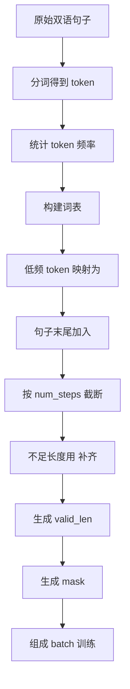

# 第 9 章：机器翻译与数据集

## 1. 本节重难点

### 1.1 这一节到底在解决什么问题

机器翻译任务不是直接把原始句子丢进模型，而是要先把一批长短不一的句子整理成模型可以并行计算的张量。

以前字符级语言模型里，我们构建的是**字符级词表**：每个字符是一个 token。机器翻译里更常见的是**词元级 token 词表**：每个词、标点或子词单元是一个 token。

这一节的核心不是“词表怎么背”，而是下面这条数据处理链：

```text
原始句子
-> 分词得到 token
-> 构建 token 级词表
-> 过滤低频 token
-> 加上 <eos>
-> 截断或 padding 到固定长度
-> 生成 valid_len / mask
-> 组成 batch 进入模型
```

一句话理解：

> 机器翻译数据集处理的本质，是把变长文本序列变成固定形状张量，同时保留哪些 token 真的有效。

---

### 1.2 为什么 token 级词表会更大

字符级词表很小，因为字符种类有限；但 token 级词表会大很多，因为自然语言里的词非常多，而且还会出现很多低频词。

所以通常不会把所有出现过的 token 都放进词表，而是设置一个最小频率阈值 `min_freq`。

比如：

```text
出现次数 < min_freq 的 token -> 当作无效词 / 未知词
```

这些低频 token 一般会被映射成 `<unk>`。

这样做的原因是：

1. 低频词太多，会让词表爆炸。
2. 很少出现的词很难学到稳定表示。
3. 词表太大会增加 embedding 参数量。
4. 大量低频词会让训练更稀疏、更难泛化。

所以 `min_freq` 的本质是：

> 舍弃太稀疏、不稳定的词，把模型容量集中在更常见、更有学习价值的 token 上。

---

### 1.3 `<eos>` 的作用：告诉模型句子在哪里结束

`<eos>` 表示 `end of sentence`，也就是句子结束符。

如果一个句子没有被截断，通常要在句子末尾加上 `<eos>`：

```text
I love machine learning
-> I love machine learning <eos>
```

它的作用不是为了凑长度，而是告诉模型：

> 这个序列到这里语义结束了，后面不应该继续生成真实词。

在机器翻译里这很重要，因为 decoder 需要知道什么时候停止生成。如果没有 `<eos>`，模型就只知道一直预测下一个 token，却不知道一句话应该在哪里结束。

---

### 1.4 截断时为什么 `<eos>` 可以消失

你这里的理解是对的：如果句子太长，超过了 `num_steps`，被截断之后 `<eos>` 可能不会出现，这是合理的。

原因是，`num_steps` 表示模型这次最多只看这么多个 token：

```text
原句 token 数 > num_steps -> 只保留前 num_steps 个 token
```

如果原句本身太长，截断后模型看到的就不是完整句子，而是一个前缀片段。这时候强行在末尾补 `<eos>` 反而会制造错误信号：

> 模型会误以为这个被截断的位置就是句子真实结束的位置。

所以更准确的规则是：

1. 如果句子长度没有超过上限，应该加 `<eos>`，表示真实结束。
2. 如果句子因为太长被截断，末尾不一定有 `<eos>`，这是可以接受的。
3. 不要把“截断位置”伪装成“真实句子结束位置”。

一句话：

> `<eos>` 代表真实结束，不代表“长度到上限了”。

---

### 1.5 padding 的作用：让 batch 可以并行计算

不同句子的长度通常不一样：

```text
句子 A: 5 个 token
句子 B: 9 个 token
句子 C: 3 个 token
```

如果不做 padding，它们就不能直接组成一个规则矩阵，因为每一行长度不同。

但深度学习训练通常希望输入形状是：

$$
\text{batch\_size} \times \text{num\_steps}
$$

所以需要用 `<pad>` 把短句补到相同长度：

```text
句子 A: token token token <eos> <pad> <pad>
句子 B: token token token token token <eos>
```

padding 的本质是：

> 用没有语义的占位符，把变长序列补成固定长度矩阵，从而让 GPU 可以并行计算。

---

### 1.6 padding 为什么不能参与训练

`<pad>` 只是为了凑形状，不是真实语言内容。如果让模型把 `<pad>` 当成正常 token 学习，就会污染训练。

所以我们需要记录每个样本里真正有效的 token 数量，也就是 `valid_len`。

例如：

```text
tokens:    A B C <eos> <pad> <pad>
valid_len: 4
```

这里有效 token 是：

```text
A B C <eos>
```

无效 token 是：

```text
<pad> <pad>
```

训练时可以根据 `valid_len` 生成 mask：

```text
有效位置 -> True / 1
padding 位置 -> False / 0
```

然后在计算 loss 或 attention 时忽略 padding 位置。

所以 mask 的本质是：

> 形状上保留 padding，语义上忽略 padding。

---

## 2. 核心流程图



这条流程的核心顺序是：

```text
先决定 token 怎么表示
再决定句子怎么结束
再决定长度怎么统一
最后决定哪些位置真正参与训练
```

---

## 3. 关键概念对比

| 对比 | `<eos>` | `<pad>` | `<unk>` |
|---|---|---|---|
| **含义** | 句子真实结束 | 补齐长度的占位符 | 未知词或低频词 |
| **是否有语义** | 有，表示结束 | 没有真实语义 | 有一种“未知”的语义 |
| **什么时候出现** | 句子正常结束时 | 序列长度不足时 | token 不在词表或低于频率阈值时 |
| **训练时怎么处理** | 应该参与训练 | 通常用 mask 忽略 | 正常作为 token 参与训练 |
| **最容易错的点** | 不要把截断位置伪装成结束 | 不要让 padding 污染 loss | 不要把所有低频词都硬塞进词表 |

---

## 4. 截断、padding、valid_len 的关系

假设 `num_steps = 6`。

如果句子比较短：

```text
原句:      A B C
加 eos:   A B C <eos>
padding:  A B C <eos> <pad> <pad>
valid_len = 4
```

如果句子刚好能放下：

```text
原句:      A B C D E
加 eos:   A B C D E <eos>
结果:      A B C D E <eos>
valid_len = 6
```

如果句子太长：

```text
原句:      A B C D E F G H
截断:      A B C D E F
valid_len = 6
```

这里不应该额外把最后的 `F` 替换成 `<eos>`，因为真实句子并没有在 `F` 结束。

这就是你刚才说的重点：

> 被截断时没有 `<eos>` 并不一定是 bug；强行加一个假的 `<eos>` 才可能误导模型。

---

## 5. 最容易错的点

1. token 级词表比字符级词表大很多，所以需要 `min_freq` 过滤低频 token。
2. 低频 token 通常不是直接删除，而是映射成 `<unk>`，这样句子结构还能保留。
3. `<eos>` 表示真实句子结束，不是简单的“序列填满了”。
4. 超过 `num_steps` 的长句被截断后，末尾没有 `<eos>` 是合理的。
5. `<pad>` 只是为了让 batch 变成矩阵，不是真实输入语义。
6. padding 位置必须通过 `valid_len` 或 mask 在 loss / attention 中忽略。
7. 不要只看张量形状正确，还要看哪些 token 是有效的。

---

## 6. 本节必须记住

机器翻译数据集处理的核心是把自然语言句子变成模型能并行计算的固定形状张量：

> token 负责表达词，`<eos>` 负责表达真实结束，`<pad>` 负责补齐形状，`valid_len` / mask 负责告诉模型哪些位置真的有效。

最关键的边界是：

> padding 是计算形状需要的假 token；`<eos>` 是语言序列真实结束的真信号。
