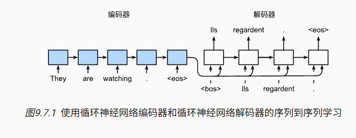
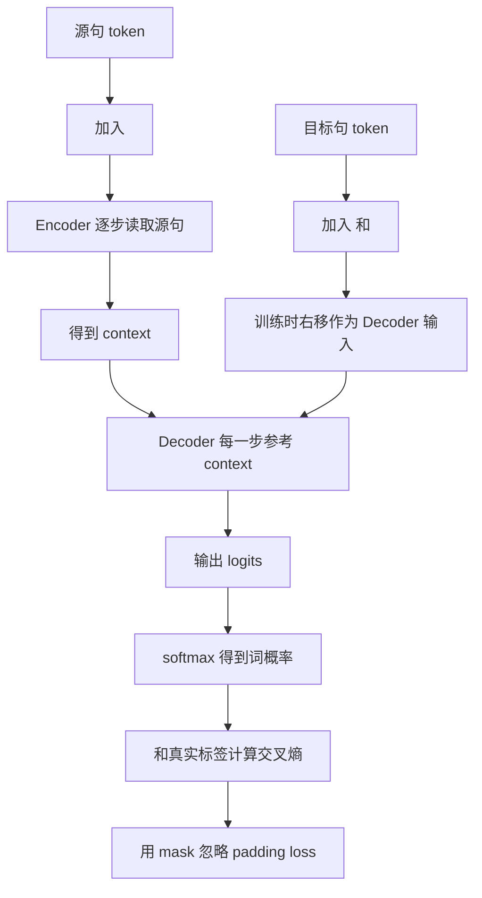
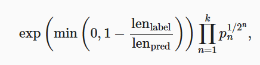

# 第 9 章：序列到序列学习

## 1. 本节重难点

### 1.1 seq2seq 要解决什么问题

序列到序列学习（sequence to sequence, seq2seq）解决的是：

> 输入是一个序列，输出也是另一个序列，而且两个序列长度可以不一样。

机器翻译就是最典型的例子：

```text
They are watching .
-> Ils regardent .
```

这类任务不能简单地做到“一个输入 token 对应一个输出 token”，因为源语言和目标语言的长度、语序、表达方式都可能不同。

所以 seq2seq 把任务拆成两个部分：

1. **Encoder**：读完整个输入序列，把源句信息压缩成上下文表示。
2. **Decoder**：根据上下文表示，一步一步生成目标序列。

一句话理解：

> Encoder 负责把源句“读懂并压缩”，Decoder 负责拿着压缩信息“逐词生成答案”。



---

### 1.2 Encoder：把源序列压缩成 context

Encoder 可以用 RNN、GRU、LSTM，甚至也可以用前面学过的双向 RNN。它的核心工作是沿着源序列不断更新隐藏状态：

$$
H_t = f(X_t, H_{t-1})
$$

最终得到一串隐藏状态：

$$
H_1, H_2, \ldots, H_T
$$

理论上，context 可以由这些隐藏状态通过某个函数得到：

$$
C = q(H_1, H_2, \ldots, H_T)
$$

最简单的做法是：

$$
C = H_T
$$

也就是直接把 Encoder 最后一个隐藏状态当作整个输入序列的压缩表示。

这个设计的直觉是：

> 最后一个隐藏状态已经一路看过前面的所有 token，所以它可以被当成源句摘要。

但这个做法也有明显局限：如果句子很长，所有信息都被压到一个向量里，前面的内容很容易丢失。这也是后面注意力机制要解决的问题。

---

### 1.3 为什么源句需要 `<eos>`

源句末尾要加 `<eos>`，表示 `end of sentence`：

```text
They are watching . <eos>
```

原因是模型本身不知道“句子在哪里结束”。如果没有 `<eos>`，Encoder 只能看到一串 token，却没有明确的结束信号。

`<eos>` 的作用是：

> 告诉模型：源序列到这里真实结束，后面不是句子内容。

注意这里和第 39 天的数据处理是一致的：`<eos>` 表示真实结束，不是 padding，也不是随便凑长度。

---

### 1.4 Decoder 为什么需要 `<bos>`

Decoder 是一步一步生成目标序列的。问题是：第一步生成时，它还没有“上一个输出 token”可以作为输入。

所以要人为加入 `<bos>`，也就是 `beginning of sentence`：

```text
<bos> -> Ils -> regardent -> . -> <eos>
```

训练时，Decoder 的输入通常是目标句整体右移一位：

```text
Decoder 输入: <bos> Ils regardent .
Decoder 标签: Ils   regardent . <eos>
```

这样模型在每个时间步都学习：

> 给定前面的真实词和 context，预测下一个目标词。

所以 `<bos>` 的本质是：

> 给 Decoder 第一步一个明确的起点，否则第一个预测没有输入入口。

---

### 1.5 Decoder 每一步为什么还要看 context

Decoder 每一步通常都需要三类信息：

1. 当前输入 token：训练时通常是真实的上一个目标 token。
2. 上一时刻隐藏状态：保存 Decoder 已经生成到哪里。
3. Encoder 的 context：保存源句的压缩信息。

可以理解成：

```text
当前输入 token + 上一隐藏状态 + 源句 context -> 新隐藏状态 -> 输出概率
```

你说“每一步都把 context 给 Decoder，是为了防止它忘掉前面的源句信息”，这个直觉是对的。

更标准的说法是：

> context 是 Decoder 生成目标句时始终需要参考的源句语义条件。

如果只在初始时给一次 context，随着生成步数变多，Decoder 的隐藏状态可能会逐渐丢失源句信息。每一步都提供 context，相当于反复提醒 Decoder：你是在翻译这个源句，而不是自由生成。

---

### 1.6 Embedding 相比 one-hot 的优势

one-hot encoding 只能表示“这个词是谁”，不能表示“词和词之间是否相近”。

比如 one-hot 里：

```text
king, queen, apple
```

它们彼此之间都是独立维度，模型看不出 `king` 和 `queen` 比 `king` 和 `apple` 更接近。

Embedding 会把 token 映射成稠密向量：

$$
x_t = \text{Embedding}(token_t)
$$

这样模型可以通过训练让语义相近的词在向量空间里更接近。

一句话理解：

> one-hot 只告诉模型“这是哪个词”，embedding 还能让模型学到“哪些词更像”。

---

### 1.7 Teacher forcing：训练和预测的关键区别

训练 Decoder 时，常用 teacher forcing。

**Teacher forcing** 的意思是：

> 训练时不把模型上一步预测的结果喂回去，而是强制使用真实的上一个目标 token 作为下一步输入。

例如目标句是：

```text
<bos> Ils regardent . <eos>
```

训练时：

1. 输入 `<bos>`，预测 `Ils`。
2. 输入真实的 `Ils`，预测 `regardent`。
3. 输入真实的 `regardent`，预测 `.`。
4. 输入真实的 `.`，预测 `<eos>`。

预测时就不一样了，因为真实答案不可见：

1. 输入 `<bos>`，预测一个词。
2. 把自己预测出来的词作为下一步输入。
3. 不断重复，直到预测出 `<eos>` 或达到最大长度。

所以 teacher forcing 的优点是训练更稳定、更快；缺点是训练和预测不完全一致。

这会带来一个问题：

> 训练时模型总是看到正确历史，预测时却要面对自己犯错后的历史。

一旦前面某一步预测错了，后面会继续在错误上下文上生成，误差可能累积。

---

### 1.8 Decoder 如何输出词概率

Decoder 每一步得到新的隐藏状态后，需要把隐藏状态转成对词表中每个 token 的预测分数。

通常做法是先经过一个全连接层得到 logits：

$$
O_t = H_tW + b
$$

其中：

$$
O_t \in \mathbb{R}^{|\mathcal{V}|}
$$

$|\mathcal{V}|$ 是目标语言词表大小。

然后用 softmax 转成概率：

$$
P(y_t \mid y_{<t}, C) = \text{softmax}(O_t)
$$

训练时再和真实标签做交叉熵损失。

一句话：

> Decoder 的隐藏状态不是最终答案，它还要经过全连接层投影到词表空间，才能判断下一个词是谁。

---

### 1.9 Encoder 和 Decoder 的隐藏状态维度必须一样吗

不一定必须一样。

简单实现里经常让 Encoder 和 Decoder 的隐藏层大小相同，这样可以直接把 Encoder 的最后隐藏状态传给 Decoder。

但如果二者维度不同，也可以加一个线性变换：

$$
H_{\text{dec},0} = WH_{\text{enc},T} + b
$$

所以正确边界是：

> 架构上不要求 Encoder 和 Decoder 隐藏维度天然相同；只是相同维度实现最方便。

---

### 1.10 为什么 loss 要忽略 padding

目标序列也需要 padding 成固定长度，才能组成 batch：

```text
真实目标: Ils regardent . <eos>
补齐后:   Ils regardent . <eos> <pad> <pad>
```

但 `<pad>` 只是占位符，不是真正要预测的词。如果把 padding 位置也算进 loss，模型就会被迫学习预测 `<pad>`，这会污染训练。

所以需要根据 `Y_valid_len` 生成 mask：

```text
真实 token 位置 -> 参与 loss
padding 位置   -> loss 设为 0
```

更准确地说，这里是 **masked loss** 或 **sequence mask**。它和注意力里的 mask 思想相似，但作用位置不同：

| 对比 | masked loss | attention mask |
|---|---|---|
| **作用位置** | 损失函数 | 注意力权重 |
| **目的** | padding 不参与 loss | padding 不被注意力看到 |
| **本质** | 不让假标签影响训练 | 不让假 token 参与上下文聚合 |

一句话：

> padding 保留在张量形状里，但不能保留在训练目标里。

---

## 2. 核心流程图



预测流程可以单独记：

```text
源句 -> Encoder -> context
<bos> -> Decoder -> 预测词1
预测词1 -> Decoder -> 预测词2
...
直到预测出 <eos> 或达到最大长度
```

---

## 3. 训练和预测的关键对比

| 对比 | 训练阶段 | 预测阶段 |
|---|---|---|
| **Decoder 输入** | 真实的上一个目标 token | 模型自己上一步预测的 token |
| **是否知道答案** | 知道目标句 | 不知道目标句 |
| **是否用 teacher forcing** | 通常使用 | 不能使用 |
| **主要问题** | 训练更稳定 | 误差会一步步累积 |
| **结束方式** | 标签中有 `<eos>` | 预测到 `<eos>` 或达到最大长度 |

这个对比是理解 seq2seq 局限的关键：

> 训练时有人带路，预测时自己走路；训练和预测输入来源不一样，所以预测时更容易连锁出错。

---

## 4. seq2seq 的两个主要局限

### 4.1 context 向量容易压缩不住长句

最简单 seq2seq 把 Encoder 最后一个隐藏状态当作全部源句信息：

$$
C = H_T
$$

这对短句还可以，但句子一长，所有信息都挤进一个向量，前面的信息就容易被遗忘。

所以它的瓶颈是：

> 固定长度 context 很难完整保存长序列信息。

这也是后面注意力机制出现的原因：Decoder 不应该只看一个总摘要，而应该在每一步生成时回头看源句不同位置。

### 4.2 RNN 生成必须一步一步来

RNN 解码有时间依赖：

```text
y_1 -> y_2 -> y_3 -> ...
```

当前输出依赖上一步隐藏状态和上一步 token，所以很难像 Transformer 那样在训练时大规模并行。

因此 seq2seq RNN 的局限可以压缩成两句话：

1. 信息压缩瓶颈：一个 context 很难装下长句所有信息。
2. 生成依赖瓶颈：一个 token 一个 token 生成，训练和推理都受顺序限制。

---

## 5. BLEU：机器翻译的评估方法

BLEU 用来评估预测翻译和真实翻译有多接近。

它主要看两件事：

1. 预测序列和标签序列有多少 n-gram 匹配。
2. 预测序列是不是过短。

公式是：



也可以写成：

$$
\exp\left(\min\left(0, 1 - \frac{\text{len}_{label}}{\text{len}_{pred}}\right)\right)
\prod_{n=1}^{k} p_n^{1/2^n}
$$

其中：

1. $p_n$ 表示 $n$-gram 的匹配精度。
2. $k$ 表示最多考虑到几阶 n-gram。
3. 前面的指数项是长度惩罚。

### 5.1 为什么要看 n-gram

如果只看单个词是否匹配，翻译可能词都对，但顺序不对。

所以 BLEU 不只看 unigram，也看 bigram、trigram 等更长片段：

```text
1-gram：词对不对
2-gram：相邻两个词搭配对不对
3-gram：更长短语结构对不对
```

越长的 n-gram 越难匹配，所以公式里给高阶 n-gram 的指数权重更小：

$$
p_n^{1/2^n}
$$

这可以理解成：

> 高阶 n-gram 很重要，但不能让它因为太难匹配就把 BLEU 分数压得过低。

### 5.2 为什么要惩罚过短预测

如果模型只预测一个很常见的词，可能匹配率看起来很高，但这显然不是好翻译。

所以 BLEU 加了长度惩罚：

$$
\exp\left(\min\left(0, 1 - \frac{\text{len}_{label}}{\text{len}_{pred}}\right)\right)
$$

当预测太短时：

$$
\text{len}_{pred} < \text{len}_{label}
$$

那么：

$$
1 - \frac{\text{len}_{label}}{\text{len}_{pred}} < 0
$$

指数项小于 1，BLEU 被惩罚。

当预测长度不短于标签时，惩罚项变成：

$$
\exp(0) = 1
$$

也就是不惩罚。

一句话：

> BLEU 既防止翻译乱序，也防止模型用特别短的预测钻匹配率的空子。

---

## 6. 最容易错的点

1. seq2seq 是 Encoder + Decoder，不是两个 Decoder。
2. Encoder 的最后隐藏状态可以作为 context，但这只是最简单做法，不是唯一做法。
3. `<eos>` 表示句子真实结束；源句和目标句都需要结束信号。
4. `<bos>` 是 Decoder 的起始输入，否则第一步没有上一个 token。
5. teacher forcing 是训练时使用真实上一个 token，不是使用模型自己的上一步预测。
6. 预测时不能 teacher forcing，只能把自己上一步预测结果喂回去。
7. Decoder 输出 hidden state 后，还要经过全连接层投影到词表大小，再计算 softmax / cross entropy。
8. Encoder 和 Decoder 隐藏维度不一定必须一样，不一样时可以线性变换。
9. padding 位置不能算入 loss，要用 `Y_valid_len` 或 mask 把这些位置的损失置零。
10. BLEU 不是只看词匹配，还看 n-gram 匹配和长度惩罚。

---

## 7. 本节必须记住

seq2seq 的核心结构是：

> Encoder 把源句压缩成 context，Decoder 在 context 条件下从 `<bos>` 开始一步步生成，直到 `<eos>`。

训练和预测的核心区别是：

> 训练时 Decoder 看真实历史，预测时 Decoder 看自己生成的历史。

它的局限是：

> 一个固定 context 很难记住长句全部信息，RNN 解码又必须按时间一步步生成。
