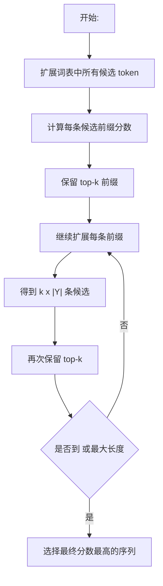

# 第 9 章：束搜索

## 1. 本节重难点

### 1.1 为什么 seq2seq 需要搜索

在 seq2seq 预测阶段，Decoder 不是一次性输出整句话，而是一步一步生成：

```text
<bos> -> y_1 -> y_2 -> ... -> <eos>
```

每一步都会给出整个词表上的概率分布：

$$
P(y_t \mid y_1,\ldots,y_{t-1}, C)
$$

所以真正的问题是：

> 每一步应该选哪个 token，才能让整句话的总体概率尽可能高？

这就是搜索问题。因为当前选哪个词，会影响后面所有条件概率。

一句话理解：

> 解码不是每一步各选各的，而是在一棵巨大的候选句子树里找一条比较好的路径。

---

### 1.2 Greedy search：每一步只选当前最大

贪心搜索（greedy search）的规则很简单：

> 每个时间步都选择当前条件概率最大的 token。

公式可以写成：

$$
y_t = \arg\max_y P(y \mid y_1,\ldots,y_{t-1}, C)
$$

它的优点是快。如果词表大小是 $|\mathcal{Y}|$，最大输出长度是 $T$，那么每一步看一遍词表，总复杂度大约是：

$$
O(|\mathcal{Y}|T)
$$

但问题也很明显：贪心只保证当前这一步最好，不保证整句话最好。

比如第一步：

```text
A 的当前概率 > B 的当前概率
```

greedy 会直接选 `A`。但是后面的概率是条件概率，选了 `A` 后，后续概率都变成：

$$
P(y_2 \mid A, C), P(y_3 \mid A, y_2, C), \ldots
$$

如果第一步选 `B`，后面的条件概率会完全变成另一条路径：

$$
P(y_2 \mid B, C), P(y_3 \mid B, y_2, C), \ldots
$$

所以有可能：

```text
第一步 A 更高，但 A 后面整体变差
第一步 B 稍低，但 B 后面整体反超
```

这就是 greedy search 的本质问题：

> 它太早做决定，一旦选错前缀，后面就只能在错误前缀上继续生成。

---

### 1.3 Exhaustive search：穷举所有可能

穷举搜索（exhaustive search）的想法是：

> 把所有可能的输出序列都枚举出来，然后选择整体概率最大的那一个。

如果词表大小是 $|\mathcal{Y}|$，最大长度是 $T$，每一步都有 $|\mathcal{Y}|$ 种可能，那么所有候选序列数量大约是：

$$
|\mathcal{Y}|^T
$$

所以复杂度是：

$$
O(|\mathcal{Y}|^T)
$$

这可以理解成一棵多叉树：

```text
第 1 步：|Y| 个分支
第 2 步：每个分支再分 |Y| 个
...
第 T 步：总共 |Y|^T 条路径
```

它的优点是理论上能找到全局最优；缺点是完全不可计算。

一句话：

> exhaustive search 结果最好，但代价爆炸；词表一大、句子一长，就根本跑不动。

---

### 1.4 Beam search：在 greedy 和 exhaustive 之间折中

束搜索（beam search）的核心是设置一个束宽 `k`：

> 每一步不只保留 1 条最好路径，也不保留所有路径，而是保留当前分数最高的前 `k` 条候选路径。

流程是：

1. 第一步从词表中选出概率最高的 `k` 个 token，得到 `k` 条候选前缀。
2. 第二步，每条候选前缀都扩展出 $|\mathcal{Y}|$ 个新候选。
3. 一共有 $k|\mathcal{Y}|$ 条新路径。
4. 从这些路径中再选分数最高的 `k` 条保留下来。
5. 重复直到生成 `<eos>` 或达到最大长度。

机制链：

```text
保留 k 条前缀
-> 每条前缀扩展整个词表
-> 得到 k × |Y| 条候选
-> 只留下分数最高的 k 条
-> 继续向后生成
```

复杂度大约是：

$$
O(k|\mathcal{Y}|T)
$$

它比 greedy 慢，因为每一步要维护 `k` 条路径；但比 exhaustive 快很多，因为不会保留所有分支。

一句话理解：

> beam search 是“带宽度的贪心”：不是只赌当前最好的 1 条路，而是保留前 `k` 条可能后面反超的路。

---

## 2. 核心流程图



这个图里最关键的是：

> 每一步扩展很多条，但只保留 `k` 条继续活下去。

---

## 3. 三种搜索方法对比

| 对比                 | Greedy search  | Beam search              | Exhaustive search |
| -------------------- | -------------- | ------------------------ | ----------------- |
| **保留候选数**       | 1 条           | `k` 条                   | 所有路径          |
| **核心思想**         | 每步选当前最大 | 每步保留 top-k 前缀      | 穷举所有序列      |
| **复杂度**           | $O(            | \mathcal{Y}              | T)$               | $O(k | \mathcal{Y} | T)$ | $O( | \mathcal{Y} | ^T)$ |
| **能否保证全局最优** | 不能           | 通常不能                 | 能                |
| **优点**             | 最快           | 质量和速度折中           | 理论最优          |
| **缺点**             | 太容易局部最优 | `k` 要调，仍可能错过最优 | 计算量爆炸        |

`k` 的边界很重要：

1. 当 `k = 1` 时，beam search 退化成 greedy search。
2. 当 `k` 接近所有可能路径数量时，beam search 越来越接近 exhaustive search。
3. 实际中 `k` 不能太小，也不能太大，要在质量和速度之间折中。

---

## 4. 为什么用 log 概率相加

一整句话的概率是每一步条件概率相乘：

$$
P(y_1,\ldots,y_T \mid C)
= \prod_{t=1}^{T} P(y_t \mid y_1,\ldots,y_{t-1}, C)
$$

但每个概率都小于 1，很多小概率连续相乘会变得非常小，容易出现数值下溢，也不方便比较。

所以实际实现中通常取 log：

$$
\log P(y_1,\ldots,y_T \mid C)
= \sum_{t=1}^{T}
\log P(y_t \mid y_1,\ldots,y_{t-1}, C)
$$

这样就把：

```text
很多小概率相乘
```

变成：

```text
很多 log 概率相加
```

一句话：

> log 不改变大小排序，但能把乘法变成加法，让计算更稳定。

---

## 5. 为什么要加长度惩罚

如果直接比较整句概率，长句会天然吃亏。因为概率一直相乘，乘的项越多，总概率通常越小。

所以 beam search 常用长度归一化分数：

$$
\frac{1}{L^\alpha}
\sum_{t=1}^{L}
\log P(y_t \mid y_1,\ldots,y_{t-1}, C)
$$

其中：

1. $L$ 是输出序列长度。
2. $\alpha$ 是长度惩罚的强度。
3. $\alpha$ 越大，对长度的归一化越明显。

这个公式的本质是：

> 不要让长句因为“多乘了几个小于 1 的概率”就天然分数更低。

注意这里不是为了防止数字“爆炸”，而是主要解决两个问题：

1. log 概率相加解决数值下溢和计算稳定性。
2. $1/L^\alpha$ 解决不同长度序列分数不可直接公平比较的问题。

---

## 6. 最容易错的点

1. greedy search 不是找全局最优，而是每一步找局部最优。
2. 当前 token 的选择会改变后面所有条件概率，所以第一步概率最高不代表整句概率最高。
3. exhaustive search 理论最好，但复杂度是 $O(|\mathcal{Y}|^T)$，实际无法用于大词表长序列。
4. beam search 不是保证最优，而是在可计算范围内保留更多可能路径。
5. `k = 1` 时，beam search 就是 greedy search。
6. `k` 越大通常候选越充分，但计算更慢，也不一定无限变好。
7. beam search 复杂度应理解成 $O(k|\mathcal{Y}|T)$，不是指数级。
8. 概率相乘会很小，所以实际比较时通常用 log 概率相加。
9. 长度惩罚主要是为了公平比较不同长度序列，不是单纯为了防止数值爆炸。

---

## 7. 本节必须记住

三种搜索方法可以压缩成：

> greedy 只保留 1 条，exhaustive 保留所有条，beam search 保留 top-k 条。

beam search 的本质是：

> 用有限宽度 `k` 在速度和搜索质量之间折中，尽量保留那些当前不是第一、但后面可能反超的候选路径。

实现时最关键的分数形式是：

> 用 log 概率相加表示整句概率，再用长度惩罚减少长句天然吃亏的问题。
